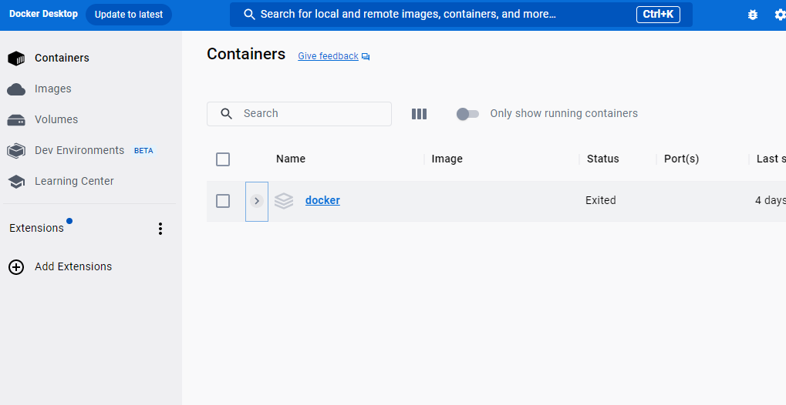

## Ontwikkelomgeving

- lees:

> Wij hebben PHP nodig samen met MYSQL en nog wat ander dingen.
> - Omdat dit lastig kan zijn met verschillende besturings systemen gebruiken wij docker

## Docker installatie

- ga naar https://www.docker.com/products/docker-desktop/
    - download de docker desktop voor jou OS
    - installeer docker desktop en kijk of je alles kan starten:
    > 
