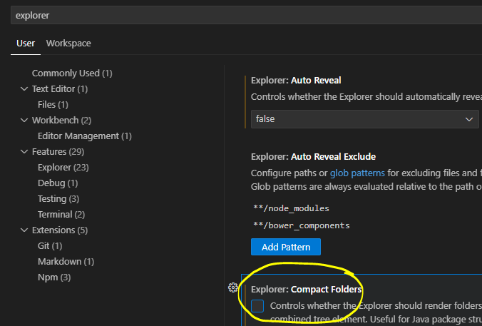

## Project folder

- lees:
> Voor dat wij gaan beginnen met code schrijven is het belangrijk om de correcte structuur neer te zetten. daarvoor moeten we een aantal dingen klaarzetten  

## visual studio settings

Om deze oefening makkelijker te maken:
- ga in visual studio code naar:
   - file
      - preferences
         - settings
   - zoek nu op explorer
      - vink de volgende setting `UIT`
      > 

## container maken

- ga naar je `M3Prog` directory 
    > deze had je in `01_gitsetup.md` gemaakt en naar je computer gehaald

- Maak een directory `m3prog_project` aan in de `M3PROG` directory
   >   
   > Dit is vanaf nu de root folder van het project.
