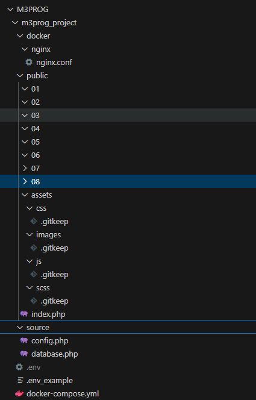

## docker project

- lees:
   > Van te voren weten wij dat het een `php-html` project gaat worden, dus de structuur is redelijk bekend. Dat gaan we nu maken

## folder openen

- open `M3Prog/m3prog_project` in visual studio code
   >   

## mappen en bestanden maken

- maak in `m3prog_project` de volgende folders:
   - `docker`
   - `public`
   - `source`

## subfolders

- Binnen de docker folder gaan wij de nginx configuratie folder maken:
   - `docker\nginx`

      > let op dit is dus eerst een folder `docker` maken, dan in die `docker` folder maak je weer een `nginx` folder 

- Binnen de public folder gaan wij de assets en images plaatsen:
   - `public\assets\css`
   - `public\assets\js`
   - `public\assets\scss`
   - `public\images`

## Voorbeeld bestanden

- lees:
   > Er zijn een aantal bestanden nodig waarmee wij straks aan de slag gaan.  
   > - deze zijn nu leeg, later vullen we die

- maak in `m3prog_project` de volgende bestanden aan:
   - `docker-compose.yml`

- dan in subfolders van `m3prog_project`
   > LET OP: dat alles in de JUISTE folder staat
   - `docker\nginx\nginx.conf`
   - `public\index.php`
   - `source\config.php`
   - `source\database.php`

## Git keep

- lees:
   > Git keep is een leeg bestandje dat ervoor zorgt dat je een lege folder kunt toevoegen aan git. Hierdoor kun je een structuur aanmaken voordat de echte bestanden straks beschikbaar zijn.

- Maak een bestand aan met de naam `.gitkeep`
- Plaats dit bestand in de volgende folders:
    - `public/assets/css`
    - `public/assets/js`
    - `public/images`

## opdrachten folders

- Maak de volgende directories aan in `public`:
   - 01
   - 02
   - 03
   - 04
   - 05
   - 06
   - 07
   - 08
- zet in al die directories ook het `.gitkeep` bestand
 
## Controlleren

- Deze stap is belangrijk, controlleer of alles goed staat zoals in het plaatje:

   > 

## klaar?

- commit alles naar je github