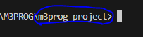
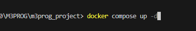
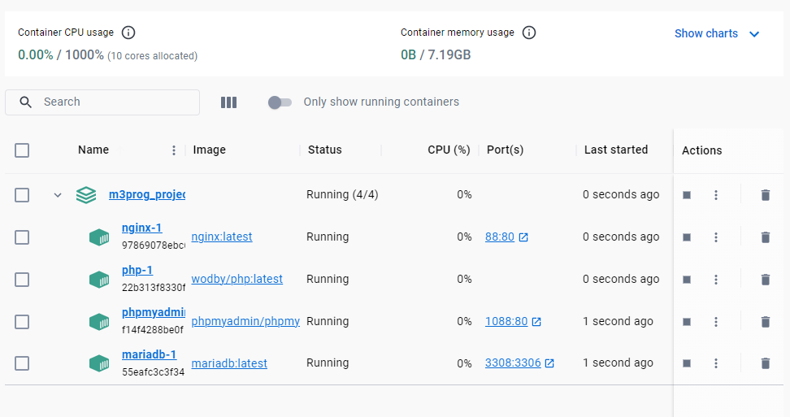
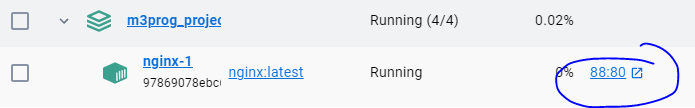

## NGinx

- lees:
  > wij hebben een docker container waar nginx in draait. Dat is onze webserver. Dat programma zorgt ervoor dat we html files door een browser kunnen laten opvragen.
  > - nginx moet geconfigureerd worden om te werken dat gaan we nu doen

## nginx conf

- zet deze code in de `/docker/nginx/nginx.conf`
```apacheconf
server {
    listen 80 default_server;
    listen [::]:80 default_server;
    
    server_name localhost;

    root /var/www/html/public;
    index index.php index.html;

    # Support Yii2 pretty URL routing
    location / {
            try_files $uri $uri/ =404;
            if (!-e $request_filename){
                    rewrite ^/(.*) /index.php?r=$1 last;
            }
    }

    location ~* \.php$ {
        fastcgi_pass php:9000;
        include fastcgi_params;
        fastcgi_param SCRIPT_FILENAME $document_root$fastcgi_script_name;
        fastcgi_param SCRIPT_NAME $fastcgi_script_name;
    }

    # Prevent additional headers like TRACE, DELETE, PUSH
    if ($request_method !~ ^(GET|HEAD|POST)$ )
        {
            return 405;
        }
}
```

## Start het project


- Zorg dat DockerDesktop aan staat
- open je visual studio code en open je `m3prog_project` als folder
  > 

- rechter muis op het `docker-compose.yml`
  - click op `open in intergrated terminal`

## docker compose in terminal

- Start docker door in de terminal het volgende te typen:
  - `docker-compose up -d`

    > 

- controlleer je docker desktop:
  - Zie je dat de container  `m3prog_project` groen is?
    > 

- Open http://localhost:88 in de browser
  - nu zie een wit scherm omdat de `/public/index.php` leeg is
  > - je kan ook op de `88:80` link in docker clicken
  >   

  
## klaar?

- commit alles naar je github