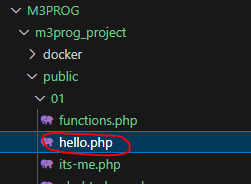
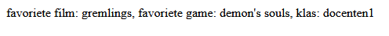
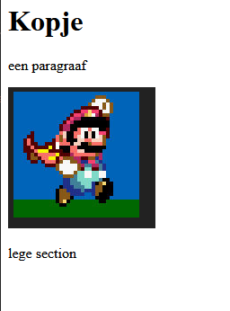

# Php script

- lees:
    > - De bestandsextensie voor PHP is `.php` (met kleine letters!)  
    > - Een PHP webpagina kun je ALLEEN uitvoeren via een webserver 
        > *DUS NIET VIA VISUAL STUDIO LIVE SERVER*
    > - Als de webserver een bestand met `.php` ziet wordt deze door PHP engine (php.exe) uitgevoerd.
    > - De uitvoer van het PHP script wordt daarna code van je webpagina
    > - Zo kun je dus gegevens verwerken of genereren op de server en het resultaat naar de webbrowser sturen


## PHP code schrijven

- lees:
> - Een PHP script begint ALTIJD met `<?php `
> - Een PHP script eindig je ALTIJD met `?>`
> - Tussen deze start- en eind PHP tags schrijf je PHP code
> - Zet je het NIET tussen deze PHP tags, dan doet PHP er niets mee!

- bekijk hoe dat eruit moet zien:
```php
<?php

//hier komt de code 
?>
```

## Php bestand

- Maak een nieuw bestand: `hello.php` in je `public\01` directory:
    > 

## Code Hello world!
- Zet de juiste start en eind tags er in
    ```php
    <?php

    //hier komt de code 
    ?>
    ```
- Zet tussen de start en eind tags deze code:
    ```php
    echo "Hello World!";
    ```

## TESTEN

- Open je browser en ga naar:
    - http://localhost:88/01/hello.php
- zie je nu hello world! staan?

## echo
- lees:
    > met echo maken we uitvoer van php, dat wordt dus html in een webserver
    > - achter echo kunnen we verschillende dingen neerzetten
    > - echo lijkt op console.writeline (c#) of console.log javascript

## Nu zelf proberen

- Maak een nieuw PHP script: `its-me.php`.
    - in de directory `public/01`

- gebruik `echo` om het volgende op het scherm te zetten:
    - jouw favoriete film
    - jouw favoriete game
    - jouw klas SD1...
- toon dit in de browser
    > Voorbeeld:  
    > 


## HTML 

- open je `public/index.php`
    - zet daar een echo in die `"<h1>Kopje</h1>"` echoed 
        - vergeet je `;` op het eind niet
        
- Open je browser en ga naar:
    - http://localhost:88/index.php
- zie je nu Kopje in grote letters staan?

- lees:
    > alles wat wij achter echo zetten wordt dus html, zo kunnen wij een website maken

## meer html

- ga verder in `public/index.php`
    - zet meer html op het scherm met echo's, denk aan p, img, section etc
        - minimaal 5 echo's!

        > 
- lees:
    > onze html is nu nog niet netjes (we hebben geen body etc) dat gaan we later beter doen

## klaar?

- commit alles naar je github
