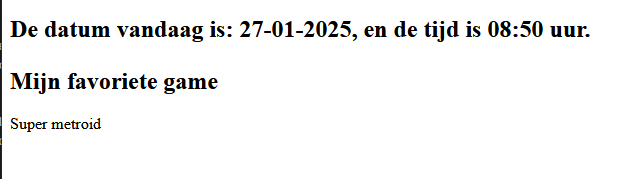

### Php + Html

- Maak nu een nieuw bestand `phphtml.php`
    - in de directory `public/01`

- lees:
    > PHP en HTML kun je samen gebruiken. Dat maakt het heel krachtig omdat je zo dynamische code (PHP) kunt mixen
    > met gewone HTML-code.

- Zet onderstaande code in het `phphtml.php` bestand
    ```php
    <!doctype html>
    <html lang="en">
        <head>
            <title><?php echo "Titel van de pagina" ?></title>
        </head>
        <body>
            <h2>De datum vandaag is: <?php echo date('d-m-Y')?>, en de tijd is <?php echo date("H:i")?> uur.
            
            <p><h2>Mijn favoriete game</h2><?php echo "Super metroid";?></p>
        </body>
    </html>
    ```
- vraag het bestand op in je browser via de juiste http://localhost:88 url.
    - check of je zoiets krijgt:
        > 


## klaar?

- commit alles naar je github


 


