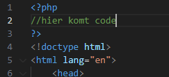
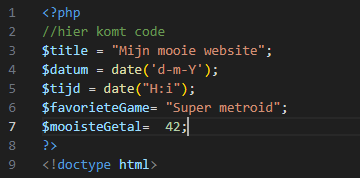
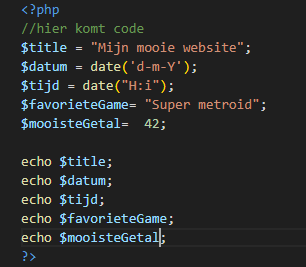
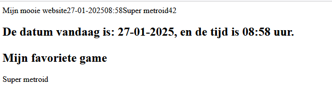

## Php code block:

    
- Maak nu een nieuw bestand `phphtml_var.php`
    - in de directory `public/01`

- zet alle code van `phphtml.php` daar in
- Zet nu boven de doctype een php open en sluit tag:
    > 

## variabelen maken
- lees:
    > een variable in php maak je door:
    > - een $ te schrijven 
    > - en daarna de naam van de variabel
    > - en dan een = met de waarde  
    > bijvoorbeeld:
    ```php
    $leeftijd = 99;
    ```

- nu maken we daar een aantal variablenen:
    > 


- lees:
> - nu we variabelen hebben kunnen we die gebruiken in de html of in php code 

## variabelen echo

- hoe zetten we een variable op het scherm?
    > 
    > 
    
## klaar?

- commit alles naar je github


 


