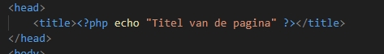
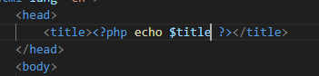
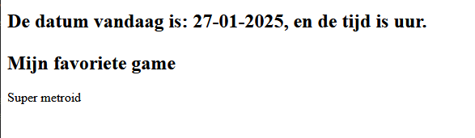
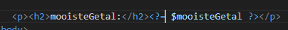

## naar het scherm!
- lees:
> - nu we variabelen hebben kunnen we die gebruiken in de html of in php 
> - dat kunnen we met een echo doen
 
 - zet de volgende code in `phphtml_var.php`
    > 

## Test!

- open http://localhost:88/01/phphtml_var.php in je browser
    - dan krijg je dit:

        > 
    
## in de html
- nu gaan we de variablen in de html gebruiken
    - zoek de volgende code
        > 
    - pas dit aan naar 
        > 

- lees:
    > zie je hoe we de "Title van de pagina" string waarde nu door een variable vervangen hebben? Dit is hoe we het horen te doen. zo kunnen we de title later aan passen of per pagina laten verschillen ^^

## Meer vervangen

- doe hetzelfde voor 

    > 

- haal nu de echos bovenaan weg, dus de echos in dit plaatje:
    > 

- open `phphtml_var.php` in je browser
    - check of je ongeveer dit ziet:
        > 

## mooi getal

- we hadden nog meer variablen die moeten ook in de html komen te staan
    - MAAR we doen dat net iets anders, zet dit ergens in body tag:
        > 

## shortcut code: <?=

- lees:
    > zie je dat we nu ```<?= $variable ?>``` gebruiken? Deze is heel kort en kan super handig zijn

- maak nu zelf nog 2 variabelen en gebruik de <?= ?> om het op het scherm te zetten:
    - favoriete show
    - leukste stad
    
## klaar?

- commit alles naar je github


 


