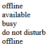

## Hoe werken variabelen:

- lees:
> elke variable is een stukje opslag in het geheugen
> - daar `bewaar` je dus `1 ding` in, bijvoorbeeld een nummer zoals 99
> - met `=` zeg je bewaar wat achter de = staat in de variable voor de =
>   - bijvoorbeeld: ```$loodsNummer = "15A";``` zegt:
>       - in variable $loodsNummer
>       - bewaar daar de string 15A in
> - van een variable kan je later de waarde weer aanpassen:

```php
$loodsNummer = "15A";
//en nu naar een andere loods:
$loodsNummer = "16A";
```


## Status maken

- Maak nu een nieuw bestand `status.php`
    - in de directory `public/01`
- maak een nieuwe variable:
    - status
        - geef deze de waarde "offline";
    
- zet de status op het scherm met echo:
 > 

## Status aanpassen

- verander geen code, maak er wel code bij:
    - verander status met een = naar "available"
        - echo het op een nieuwe regel:
        > 

- maak nu de volgende statussen erbij:
    - busy
    - do not disturb
    - offline
- test!:
    > 


## Prijs

- maak een nieuwe variable:
    - prijs
        - met de waarde 20.5

- zet die op het scherm

- verander nu de prijs 5 keer en zet dat op het scherm
    > 
    
## klaar?

- commit alles naar je github
