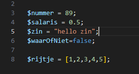
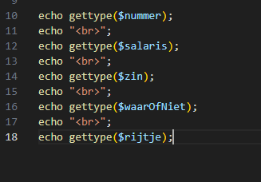

# types en variables

- maak een nieuwe file:
    - `public/02/showtypes.php`

- zet de volgende code daarin:
    > 

## Types laten zien

- nu gaan we de types laten zien:
    - zet het volgende code in de file:
        > 

## Test

- bekijk `showtypes.php` in je browser *(via docker)*
    - zie je dat elke variable een ander type weergeeft?

# Soorten gegevens (data typen)

- lees het onderstaande:

> In PHP ken je een aantal basis gegevens soorten (data types)

| Soort                                                                       | Beschrijving                                 | PHP Voorbeeld         |
|:----------------------------------------------------------------------------|:---------------------------------------------|:----------------------|
| [String](https://www.php.net/manual/en/language.types.string.php)           | Voor teksten of tekens                       | $naam = "Klaas Vaak"; |
| [Integer](https://www.php.net/manual/en/language.types.integer.php)         | Voor hele getallen                           | $jaar = 2022;         |
| [Float (of Double)](https://www.php.net/manual/en/language.types.float.php) | Voor getallen met cijfers achter de komma    | $lengte = 56.78;      |
| [Boolean](https://www.php.net/manual/en/language.types.boolean.php)         | Voor True of False                           | $isGeslaagd = false;  |
| NULL                                                                        | Voor variabelen die (nog) geen waarde hebben | $nogLeeg = null;      |

> Daarnaast heb je nog ander datatypen. De belangrijkste waar je nog mee gaat werken deze periode is de *Array*.  
> Hier vind je meer info over naamgeving van variabelen in PHP:
https://www.php.net/manual/en/language.variables.basics.php

# Maak verschillende soorten variabelen

- Maak een bestand `datatypes.php`
    - in de directory `public/02`

Kijk naar de voorbeelden hierboven en kies het juiste soort variabelen bij de inhoud

- Maak variabelen in `datatypes.php`:
    > - Maak een variabele:
    >     - met `huisnummer` (kies een duidelijke naam en > schrijf de juiste code)
    > - Maak een variabele waarin staat:
    >     -  of je `wel of niet geslaagd bent voor je rijbewijs`
    > - Maak een variabele met:
    >     -  de `prijs` voor een `liter` Euro 95 benzine

## op het scherm
- Gebruik `echo` om:
    - de variabelen onder elkaar op het scherm te zetten.

## klaar
- commit alles naar je github

