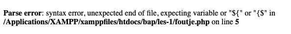

## Foutmelding testen

- lees:
    > Je gaat nu expres een fout maken om te kijken of je nu de foutmeldingen krijgt te zien


- Maak een nieuw bestand: `foutje.php`
    - in de directory `public/02`
- Schrijf de start en eind PHP tags die je inmiddels kent
- Zet tussen de PHP-tags deze code:

```php
echo "Dit is foute code omdat de quotes niet dezelfde zijn';
echo 100/0; // Hier wordt door nul gedeeld, dat is ook een fout!
```

## Test
- Open dit bestand via je localhost:88
    - als het goed is zie je nu een foutmelding:
        > 

## Repareren
- fix nu de fout:
    - verander ' naar "
    - deel niet meer door 0 maar door bv 10
- probeer het nogmaals

## andere fout

- maak een nieuwe php:
    - `fout2.php`
        - in de directory `public/02`

```php
echo "dit is goed toch?"
echo "hoop ik?"
```

- Open dit bestand via je localhost:88
    - als het goed is zie je nu een foutmelding:
    > *Parse error: syntax error, unexpected end of file, expecting "," or ";" in /var/www/html/public/fout2.php on line 2*  
    > - Dit betekent dat je je `;` vergeten bent achter de regels

## Repareren

- fix nu de fout
    - probeer het nogmaals


- lees:
> LEES altijd de fouten goed, er zit altijd een hint in wat je moet doen:
> - de regelcode `on line 2` (Waar moet je ongeveer kijken)
> - wat voor fout het is:
>       - `unexpected end of file, expecting "," or ";"`


## klaar
- commit alles naar je github

