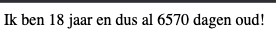
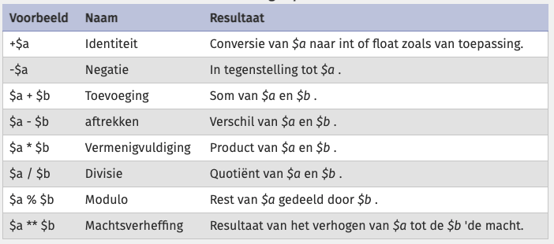
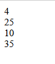

# Rekenen met PHP - Arithmetic operators

Met PHP kun je uiteraard ook berekeningen uitvoeren.

```php
<?php

    //direct met getallen
    $eenPlusEen = 1 + 1;
    $tienMinVijf = 10 - 5;

    //met variabelen
    $leeftijd = 18;
    $dagen_per_jaar = 365;

    $leeftijd_in_dagen = $leeftijd * $dagen_per_jaar;

    //en dan op het scherm:
    echo "Ik ben " . $leeftijd . " jaar " . " en dus al " . $leeftijd_in_dagen . " dagen oud!"; 
?>
```

Dat ziet er dan zou uit:

> 

### Dit zijn de arithmetic operators in PHP


> 


### Oefenen met een aantal formules

- Maak een nieuw bestand:
    - `simplecalc.php` 
        - in de directory `public/02`
- maak 4 variabelen, geef ze even de waarde 0:
    - som1
    - som2
    - som3
    - som4

- reken het volgende uit en zet op het scherm:
    > vervang de 0 achter je variabelen ```$som1 = 0;``` met de sommen
    - som1: 2 plus 2
    - som2: 5 keer 5
    - som3: 100 gedeelt door 10
    - som4: 60 min 25

## TESTEN
- open `simplecalc.php`  in je browser
    - kijk of het werkt.
        > 


## met variabelen

- maak nu een nieuwe variabel:
    - varsom1
        - geef die de waarde:
            - som1 keer som2

            
- maak nu een nieuwe variabel:
    - varsom2
        - geef die de waarde:
            - som4 gedeelt door som3

            
- maak nu een nieuwe variabel:
    - varsom3
        - geef die de waarde:
            - varsom1 keer som4 gedeelt door varsom2 min som2
            > hier komt 975 uit, dit heeft met de volgorde van rekenen te maken


## klaar
- commit alles naar je github


## INFO

Hier vind je meer info over de arithmetic operators, met voorbeelden:

- https://nl.wikibooks.org/wiki/Programmeren_in_PHP/Rekenen
- https://www.php.net/manual/en/language.operators.arithmetic.php

