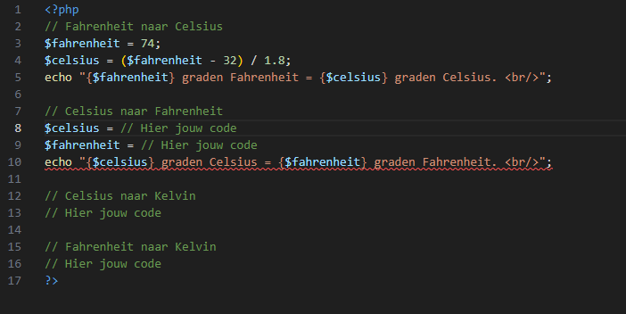

### Oefenen met een aantal formules

- Lees dit eerst door:
    - https://nl.wikihow.com/Omrekenen-tussen-Celsius-en-Fahrenheit
        > Hier vind je de formules die je gaat gebruiken in je PHP-code.

- Maak een nieuw bestand:
    - `temperatuur.php` 
        - in de directory `public/02`

- neem deze code over in `temperatuur.php` :    
    > 
    > - hiermee rekenen we `Fahrenheit naar Celsius` om

- schrijf nu de PHP-code die onderstaande formules gebruiken:

    - `Celsius naar Fahrenheit`
    - `Celsius naar Kelvin`
    - `Kelvin naar Celsius`

## TESTEN
- open `temperatuur.php`  in je browser
    - kijk of het werkt.

## klaar
- commit alles naar je github

## Bonus

- Zet de uitgevoerde berekening leesbaar op het scherm (gebruik de variabelen in de `echo`)
- Je ziet dan de berekening met de echte waarden van de variabelen in de tekst die je toont. 

## Bonus klaar?
- commit alles naar je github

## INFO

Hier vind je meer info over de arithmetic operators, met voorbeelden:

- https://nl.wikibooks.org/wiki/Programmeren_in_PHP/Rekenen
- https://www.php.net/manual/en/language.operators.arithmetic.php

