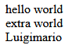
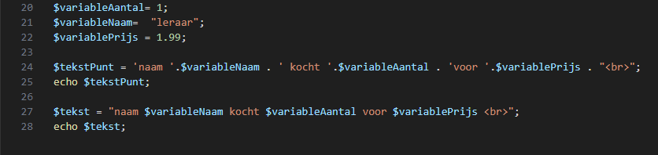

## 2 soorten strings?

- lees:
    > je kan in php een string met `'` of met `"` gebruiken
    > - `'` strings zijn standaard en doen niets extra
    > - `"` is een speciale variant waar je variablen in kan zetten
    >     - php doet daar wat extra mee

- maak een nieuwe file:
    - `plak.php`
        - in de directory `public/02`

## soorten proberen

- maak deze code na:
    > 
    - beantwoord: 
        - waarom zet ik er een `<br>` in?
- echo beide strings 
    - test!
        > 

    
## plakken

- lees:
    > - in php plakken we strings met `.` aan elkaar
    >     - in andere talen is dat met de `+`
    ```php
    $totaleString = "hello" ." ". "world" . "<br>";
    //totaleString wordt dus: "hello world<br>"
    ```
- maak 2 nieuwe strings:
    - voornaam
        - geef deze de waarde:
            - luigi
    - achternaam
        - geef deze de waarde:
            - mario
- plak voornaam en achternaam aan elkaar
    - zet dat in een nieuwe variable: 
        - fullname
            - echo fullname naar het scherm

## TEST
- test:
    > 
    - plak er nog een spatie bij
    - plak er ook een `<br>` bij


## insert variable

- lees:
    > strings met `"` kan je variablen in zetten:
    > - je zet dan gewoon de variable erin:
    >   ```$mijnString= "$variableNaam zegt hallo!";```

- bekijk deze voorbeeld code:
    > 

## klaar
- commit alles naar je github

