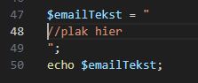

## Start
- ga verder in:
    - `plak.php`
        - in de directory `public/02`
        
        
## insert variable

- lees:
    > strings met `"` kan je variablen in zetten:
    > - je zet dan gewoon de variable erin:
    >   ```$mijnString= "$variableNaam zegt hallo!";```

- bekijk deze voorbeeld code:
    > 


## zelf doen

- maak nu variabelen aan:
    - naam
        - waarde:
            - Yoshi
    - ondertekentDoor:
        - waarde:
            - directeur bowser

- maak nu deze code na:
    > 
    - vervang `//plak hier` door
        ```php
        Beste ...<br>
        Helaas moeten wij uw verzoek afwijzen.<br>
        Onze Goomba's vinden het niet leuk om opgegeten te worden<br>
        <br>
        Hoogachtend<br>
        ...<br>
        <br>
        PS:<br>
        De princess is in haar kasteel... voor nu :>
        ```

- vervang nu de eerste `...` door:
    - $naam
        > 
- vervang nu de tweede `...` door:
    - $ondertekentDoor

## test!
- test je code:
    > 

## Goomba's?

- maak een nieuwe variable:
    - enemy
        - waarde:
            - een andere vijand dan Goomba
- vervang nu Goomba's door die variable:
    > 
    
## klaar
- commit alles naar je github

