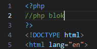
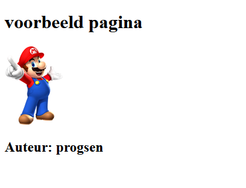

# PHP en HTML combineren

#### UITLEG
- lees:
  > De kracht van PHP is dat je het kunt combineren met HTML.
  > 
  > Wil je PHP-code schrijven die iets doet? Je opent een PHP tag, schrijft de > PHP-code en sluit af met de eind PHP-tag.  
  >  
  > **Je kunt op ELKE plek een PHP tag openen en iets in de HTML zetten!**

*Voorbeeld:*
```php
<?php
$image = "https://www.amsterdamsdagblad.nl/image/1659_1747_1200_1200.jpg";
$titel = "Mediacollege Amsterdam";
?>
<h1><?php echo $titel; ?></h1>
" alt="<?php echo $titel?>" />
 ```
- hoeveel stukken php code zie je hier?

## File maken

- Maak een nieuw bestand:
  - `php-en-html.php`
    - in de directory `public/02`

- type in Visual Studio Code: 
  - `! + TAB`
    > 
  - nu krijg je een html start
    > 


## Php code

- voeg een php blok toe bovenin de file:
    > 

## variabelen
- Maak bovenin in een PHP blok `3 variabelen`:
    - Voor de titel van de pagina
      - met waarde: 
        > `Een php html voorbeeld pagina`
    - Voor de URL naar een `afbeelding` van het internet
    - Voor de alternatieve text van de afbeelding
    - Voor `auteur`:
        - met waarde:
          > - jouw eigen `githubnaam` 

## Echo in html


- lees:
> er zijn 2 manieren om php variabelen in je html te krijgen
> - in het voorbeeld hieronder zetten we:
>     - in de HTML tag `<main>`:
>         - de waarde van $mijnVariable;

#### lange versie

```php
<main>
<?php echo $mijnVariable;?>
</main>
```

#### korte versie

```php
<main>
<?= $mijnVariable;?>
</main>
```

## opdracht echo in html:

- maak in html een ``

- Gebruik de *lange versie* van `echo` om :
  - de ... te vervangen door:
    - de `image url` variable .
 
  - de *** te vervangen door:
    - de `alternatieve text` variable

## Auteur
- maak in html een `<section>`
  - zet hier een title in waarin staat:
    - `Auteur: ...`

- gebruik nu de *korte versie* om:
    - de `...` te vervangen met `auteur` *(de variabele dus!)*

## Testen

- Open je `php-en-html.php` in je browsers *(vergeet docker niet)* en:
    - kijk of de pagina uitvoer correct is:
        > onze oplossing ziet er bijvoorbeeld zo uit:
        > 


## klaar
- commit alles naar je github
