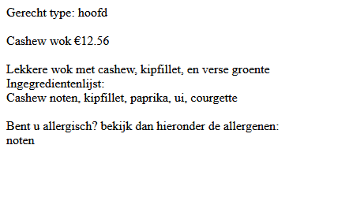

## insert variable

- maak een nieuwe file:
    - `menu.php`
        - in de directory `public/02`
- lees:
    > voor een klant maken wij een php pagina met details van het menu van het restaurant
    > - we beginnen met 1 gerecht op het scherm te zetten, we krijgen van de klant een vast formaat daarvoor


- bekijk het formaat:

        ```php
        Gerecht type: <TYPEGERECHT><br>
        <br>
        <NAAMGERECHT> €<PRIJS><br>
        <br>
        <BESCHRIJVING><br>
        Ingegredientenlijst:<br>
        <INGREDIENTENLIJST><br>
        <br>
        Bent u allergisch? bekijk dan hieronder de allergenen:<br>
        <ALLERGENENLIJST><br>
        ```

- zet dit formaat als string variable in je code 
## Variablene maken!

- zoek nu een gerecht op uit een restaurant bij jouw uit de buurt
    > Hou deze even bij de hand

- maak de variablen die je ziet in het formaat
    - bijvoorbeeld: `<TYPEGERECHT>` wordt $typeGerecht
        - met 1 van de waarden:
            - voor, hoofd, na

## invullen

- vervang nu de `<TYPEGERECHT>` in het formaat door de variablen

- test:
    > 

## klaar
- commit alles naar je github

