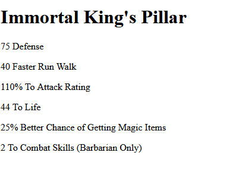

## insert variable

- maak een nieuwe file:
    - `item.php`
        - in de directory `public/02`
- lees:
    > We gaan nu een diablo item op het scherm tonen
    > - eerst maken we de variabelen
    > dan zetten we die met html netjes op het scherm

## maken
- zoek een item op
    - minimaal 4 stat bonusses
        > https://diablo2.wiki.fextralife.com/Equipment

## zet het op het scherm

- test:
    - voorbeeld:
        > 

## klaar
- commit alles naar je github

