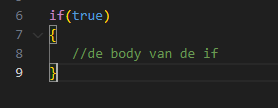
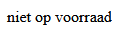
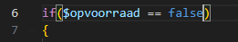
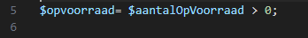

# If statement

- lees:
    > Met het `if` test je of iets WAAR is en DAN voer je code uit, Dus je start, dan is er een expression (een test) waar true of false uit komt  
    >

## Simpel begin

- Maak een nieuw bestand:
    - `if.php` 
        - in de directory `public/03`

- maak een nieuwe variabel:
    - opvoorraad
        - geef deze false als waarde
            > LET OP dit is een bool geen string, dus geen ""!
            ```php
             $eenBoolVariable =false;
            ```
- schrijf nu deze if:
    > laat het commentaar `//de body... `even weg
    > 

- zet in de body een echo:
    - "niet op voorraad"

## test

- open if.php en test:
    > 

## nu echt

- lees:
    > Nu zetten we altijd "niet op voorraad" op het scherm
    > - dit komt omdat tussen de () true staat, dus altijd waar
    > - als wat tussen de () staat WAAR is wordt de code in de body uitgevoerd

- we vervangen nu de true door een test:
    > 

- lees:
    > als $opvoorraad de waarde false heeft
    > - dan is $opvoorraad GELIJK aan false
    > - als het GELIJK is wordt het dus waar
    > - als $opvoorraad true zou zijn is het NIET GELIJK aan false, en dus niet waar

## Test

- open if.php en test:
    > 

- verander nu $opvoorraad naar true
    - test nog een keer:
    > 
    > dit klopt nu zien we niets


## aantallen

- maak een nieuwe variabel, boven aan in de code:
    - $aantalOpVoorraad;
        - zet deze even op 20

## groter dan

- we veranderen $opvoorraad
    > 
- lees:
    > - nu testen we of een nummer ($aantalOpVoorraad) groter is dan 0
    > - daar komt dan true of false uit.
    > - die boolean waarde wordt dan in $opvoorraad opgeslagen

## Test

- test of de code werkt als:
    - aantalOpVoorraad groter dan 0
    - aantalOpVoorraad 0 is
    - aantalOpVoorraad kleiner dan 0 is
    
## klaar
- commit alles naar je github

