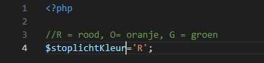
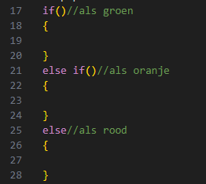

# If else statement

- we gaan verder in:
    - `elseif.php` 
        - in de directory `public/03`
- zet daar de standaard html in
## stoplicht

- maak nu een stoplichtKleur variabel
    >


## else if

- nu maken we een if, met een else if en een else:
    >


## kleuren
- zet echo's in alle bodies:
   ```Html
    <button style='background-color:#FF0000;height:25px;width:25px;'/>
    ```
    - verander de kleur (#FF0000) voor oranje en groen


## if tests

- vergelijk nu stoplichtKleur met de letters:
    - 'G'
    - 'O'

## testen

- test alle kleuren door stoplichtKleur aan te passen

    >  
    >  
    >
    
## klaar
- commit alles naar je github

