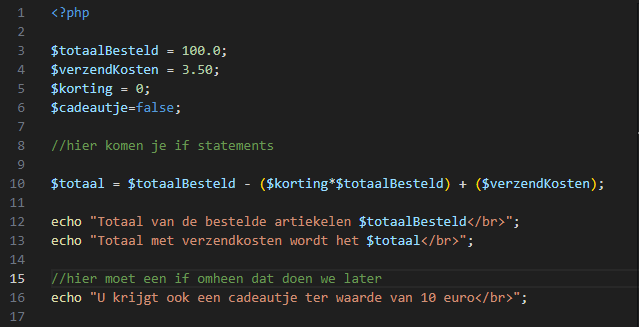
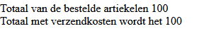
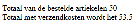

## Cijfers vergelijken 

- lees de brieving van de klant:
    > Wij hanteren de volgende regels:
    > - als de klant meer dan 100 euro besteld dan zijn er gratis verzendkosten
    > - als de klant meer dat 250 euro besteld dan krijgt de klant 5% korting
    > - als de klant 400 euro of meer besteld dan krijgen ze een gratis cadeautje ter waarde van ~10 euro

- lees:
    > hier hebben we dus meerdere malen de Groter en Gelijk aan vergelijking nodig
    > - dat is dus >=
    > - voorbeeld 10 >= 0? Dat wordt true

## Bouwen

- Maak een nieuw bestand:
    - `korting.php` 
        - in de directory `public/03`
    
- zet de volgende code in de php file:
 > 

## eerste If

- maak een if statement:
    - test of totaalBesteld >= 100 is
        - als dat waar is zet $verzendKosten op 0

## Testen

- test of je totaal nu 100 euro is
 > 

- zet $totaalBesteld op 50, en kijk nog een keer
 > 

## andere ifs:

- maak een if statement:
    - test of totaalBesteld groter of gelijk aan 250 is
        - als dat waar is zet $korting op 0.05
            > 0.05 is een makkelijke manier om 5% in rekensommen te gebruiken, 100 * 0.05 = 5 

- maak een if statement:
    - test of totaalBesteld groter of gelijk aan 400 is
        - als dat waar is zet $cadeautje op true

## En dat cadeau dan?

- maak een if statement onder de echo's van het totaal:
    - test of cadeautje waar is
        - zet de ```echo "U krijgt ook een cadeautje ter waarde van 10 euro</br>";``` in die if statement body `{}`
        
## TESTEN

- open je `korting.php` via je localhost:88 om je code te testen
    - test alle gevallen:
        - bestelling = 
            - 50 euro
            - 112 euro
            - 304 euro
            - 500 euro


## Meer korting!

- voeg nog 1 if statement toe:
    - als je meer dan 1000 euro besteld krijg je 7.5% korting
    - en wordt de cadeau waarde 40 euro
        > Hier moet je een extra variable voor maken ```$cadeauWaarde ```
        
## klaar
- commit alles naar je github

