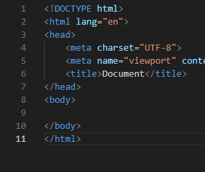
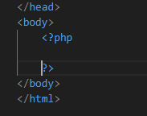

## nieuwe file
- Maak een nieuw bestand:
    - `incHtml.php` 
        - in de directory `public/03`
- maak ook 2 html bestanden in een views folder
    >

## html

- maak eens standaard html in je incHtml.php
    >

- maak boven in de file een nieuwe variabel:
    - loggedIn
    - met waarde false
    > vergeet je php tag niet

- zet daar een stuk phpcode in je html:
    >

- maak daar een if else in 
    - in de if test je of loggedIn true is

## include

- in de body van de if zet je:
    >
- in de else:
    >

## views

- open `home.html`
    - zet daar een button in met tekst login
        >

- open `myDashboard.html`
    - maak het volgende na in die html:
        >

## test

- test nu wat je ziet als je $loggedIn veranderd:
    - true:
        > 
    - false:
        > 

## dynamisch

- pas $loggedIn aan:
    >   
    > de uitleg over $_GET komt later

- open `home.html`
    - haal alles weg
        - zet daar nu dit in:
            >   

## test

- open je pagina
    - test wat er gebeurt als je op de LogIn link clickt
        >   

## klaar
- commit alles naar je github
