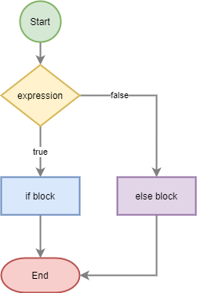

# If - Else statement

- lees:
    > Met het `if` en `if - else` statement bepaal je of code WEL of juist NIET wordt > uitgevoerd.

    >

## Opdracht: Reiskosten - Oefenen met if en else 

- Maak een nieuw bestand:
    - `reiskosten.php` 
        - in de directory `public/03`
    
- schrijf PHP-code voor onderstaande situatie:

    > #### DATA
    > - Je gaat op vakantie met de auto van `Amsterdam` naar `Frankrijk` naar de plaats `Bordeaux`.
    > - Je auto gebruikt `1 liter benzine` per `15 km`.
    > - In de tank van je auto kan `50 liter` benzine.

## Opzoeken

- Zoek de afstand naar Bordeaux op met `twee cijfers` achter de komma
    - Zet de afstand in een `variabele`
- Zet de prijs voor een liter Euro 95 in een variabele 
    - (gebruik `1.89 euro`)
- zet de prijs voor een enkele treinreis naar Bordeaux op:
    - `60 euro`
    - zet deze in een `variabele`
- Zet de `tankinhoud` in een `variabele`

## Opdracht

- Bereken hoeveel `liter` je gebruikt
    - zet dit in een `variabele`
- Bereken het `aantal keren` dat je moet `tanken`
    - zet dit in een `variabele`
- Bereken `de kosten` voor de reis met de auto
    - zet dit in een `variabel`

## Resultaat tonen
- gebruik een `if - else` statement om:
    - te testen of de kosten `hoger` zijn dan dan de `treinreis`
        - als de kosten hoger zijn:
            - dan zet je op het scherm: `Ik ga met de trein`.
        - `Anders`:
            - zet je op het scherm: `Ik ga met de auto`.

- Zet ook op het scherm: 
    - De totale afstand, 
    - totale prijs, 
    - het aantal liter bezine dat je verbuikt
    - het aantal keren dat je moet tanken 

## TESTEN

- open je `reiskosten.php` via je localhost:88 om je code te testen

## Bonus:

- Gebruik HTML en CSS om er een mooie pagina van te maken
- Probeer de literprijs te veranderen en te kijken vanaf welke literprijs het voordeliger is om met de auto te gaan

## klaar
- commit alles naar je github

## Extra info

Hier vind je meer info over het if en if-else statement in PHP:
- https://www.php.net/manual/en/control-structures.if.php
- https://www.w3schools.com/php/php_if_else.asp

