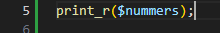
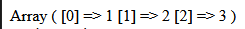
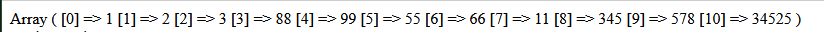

## Arrays

- lees: 
    > - In een array kun je lijsten / verzamelingen gegevens opslaan. Denk aan een lijst met temperaturen, namen, prijzen etc.
    > - Een array bevat dus meerdere waarden en dat is handig. Je kunt al die waarden in één variabele opslaan.
    > - Je kan ook voor alle elementen (dingen) in die array 1 stuk code uitvoeren
    >       - bijvoorbeeld:
    >           - op het scherm zetten
    >           - doorgeven aan andere code
    >           - wijzigingen doen

- lees deze uitleg:
    > Zo maak je een array in PHP (beide regels doen `hetzelfde`, de tweede regel is wat minder typen):

```php
// Lege array maken (langere manier)
$data = array();

// Lege array maken (kortere manier)
$data = []

// Langere manier, met gegevens
$dagen = array("maandag", "dinsdag", "woensdag", "donderdag", "vrijdag", "zaterdag", "zondag");

// Verkorte manier, met gegevens
$dagen = ["maandag", "dinsdag", "woensdag", "donderdag", "vrijdag", "zaterdag", "zondag"];
```

## OPDRACHT

- maak een nieuwe file:
    - `arrays_uitleg.php`
        - in de directory `public/03`
        
- laten we even kort 1 array samen maken:
    - maak een nieuwe variabel:
        - nummers
    - zet achter nummers een =
        - en achter de = ```[1,2,3]```

- sluit de regel af met een ; als je dat nog niet gedaan had
- schrijf nu op de volgende regel:
    > 


## Test

- open `arrays_uitleg.php` nu in je browser en kijk:
    > 

## meer nummers

- voeg nu extra nummer toe, minimaal 7
    > gewoon door , nummer, nummer etc
- test je nieuwe array
    > 


## klaar
- commit alles naar je github
