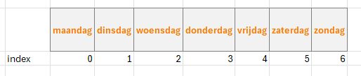
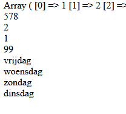
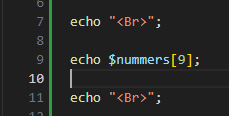
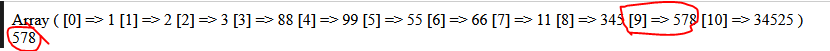

## Elementen

- lees:
    > - Een element is `1 ding` wat in `1 hokje` van de array zit
    > - Het `1e element` in een array heeft `index 0`, het 2e index 1 enzovoorts. 
    > - een index is het `huisnummer` van het `hokje`

- lees dit voorbeeld:
    > we hebben deze array:
    ```PHP
    $dagen = ["maandag", "dinsdag", "woensdag", "donderdag", "vrijdag", "zaterdag", "zondag"];
    ```

    > Om "donderdag" op te halen kun je de `index 3` gebruiken:
    > 

    ```php
    echo $dagen[3]; 
    // Er wordt "donderdag" op het scherm gezet
    ```

## dagen pakken

- neem de dagen array over 
```PHP
$dagen = ["maandag", "dinsdag", "woensdag", "donderdag", "vrijdag", "zaterdag", "zondag"];
```

- laat nu de volgende dagen, ONDER elkaar zien:
    - vrijdag
    - woensdag
    - zondag
    - dinsdag

## test

- test je code:
    > 

## proberen
- nu nogmaals met onze nummer:
    - schrijf het volgende in je code:
        > 
    - zet nu tussen de `[]` een nummer van 0-9
- test
    > ik kies 9 dan krijg ik:
    > 

- zet nu je 2de nummer ook op het scherm
    - gebruik `[1]`
- test! klopt het?

- zet nu de volgende nummers op het scherm:
    - de 1ste
    - de 5de
- test! klopt het?

## klaar
- commit alles naar je github
