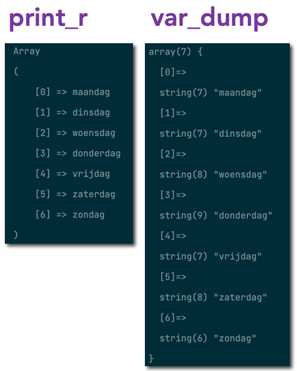

## Eigen array

- maak een nieuwe file:
    - `arrays_eigen.php`
        - in de directory `public/03`
        
- maak nu zelf een array in die php file, kies een onderwerp:
    > - berichten
    > - games
    > - zangers
    > - youtubers
    > - streamers
   
- de `variable` waar de `array` in zit heeft de naam van 1 van onderwerpen hierboven
    > - voorbeeld: 
    > je kies `autos` dan heb je `$autos = ...`

- zet er `5 elementen` in (zie dagen)
    - print de array met `print_r`


## OPDRACHT elementen

- echo nu het 3de en 5de element van jouw array in `arrays_uitleg.php` 
    - open je browser en check of je het op je scherm ziet
    - gebruik `echo "<br>";` om de regels onder elkaar te zetten

## verschillende echos van een array

- lees deze uitleg:
    > - Een array kun je **NIET** met `echo $namen` op het scherm zetten (zoals een tekst of een getal):
    > 
    > - Je kunt wel `var_dump()` of `print_r()` gebruiken.

- Bekijk het php code voorbeeld hieronder:
    ```php
    // Print de array in tekst formaat
    print_r($dagen);   

    // Geeft wat extra info over het soort data dat er in zit
    var_dump($dagen); 
    ```
    > 

## Opdracht: Printen/Echo

- `echo` je `array` op deze manier
    - `echo $namen` 
        > dit is om te kijken wat er gebeurt!
        > 
        
- `print_r` je `array`
- `var_dump` je `array`
- `kijk` even naar het `verschil` in output


## klaar
- commit alles naar je github
