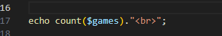
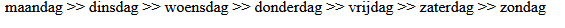
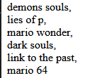
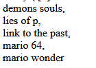

## Andere functions

- lees:
    > Er zijn veel [array functions](https://www.php.net/manual/en/ref.array.php) in PHP om met arrays te werken. We gaan er een aantal proberen:
    > - count
    > - array_push
    > - implode 
    > - explode


## Count

- lees:
    > - Vaak willen we weten hoeveel dingen in een array zitten, in php gebruiken we daar [count()](https://www.php.net/manual/en/function.count.php) voor

    ```php 
    echo count($dagen); 
    // 7
    ``` 
## Proberen

- werk nu verder in de file:
    - `arrays_eigen.php`

 - print nu het aantal elementen in je array:
    > 

## Elementen toevoegen

- lees:
    > - Iets toevoegen aan een array kan met [array_push()](https://www.php.net/manual/en/function.array-push.php) of met de korte versie: `[]`

    ```php
    // Lange manier
    array_push($dagen, "nog een dag");

    // Verkorte manier 
    $dagen[] = "nog een dag";

    //De array $dagen wordt bevat nu een extra element
    echo count($dagen); // 8
    ```

- voeg met `array_push` nog 1 element toe
    - `print_r` je array nogmaals
- gebruik count nogmaals om de nieuwe lengte op het scherm te zetten

## Array naar een String

- lees:
    > Met [implode()](https://www.php.net/manual/en/function.implode.php) kun je alle elementen aan elkaar plakken en omzetten in een string (met een scheidingsteken)

    ```php
    echo implode(' >> ', $dagen);
    //dit zet het volgende op het scherm:
    // maandag >> dinsdag >> woensdag >> donderdag >> vrijdag >> zaterdag >> zondag
    ```

    > 

    
- `echo implode` nu met ` ` je array
    - je krijgt dan ongeveer zoiets op je scherm:
        > 
- doe dit nogmaals alleen dan met `,<br>`: 
    > 


## Sorteren

- lees het sorteer voorbeeld:

    ```php
    // Sorteer op alfabet
    sort($dagen);
    echo implode(' >> ', $dagen);
    // dinsdag >> donderdag >> maandag >> nog een dag >> vrijdag >> woensdag >> zaterdag >> zondag
    ```

- `sort` je array 
    - print_r je array
        > 
    - zet het nu weer met breaks op het scherm:
        > 

## klaar
- commit alles naar je github

## Documentatie
Hier vind je meer info over arrays en handige array functions in PHP:

- https://code.tutsplus.com/tutorials/working-with-php-arrays-in-the-right-way--cms-28606
- https://www.php.net/manual/en/language.types.array.php
- https://www.php.net/manual/en/ref.array.php

