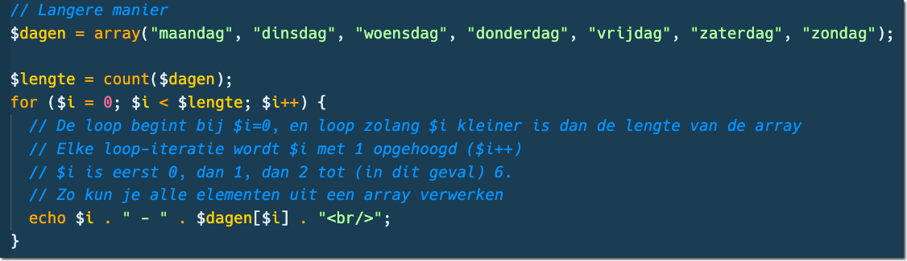
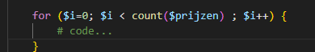
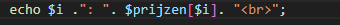
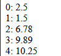

# For loop door een array

> Een for-loop gebruik je om een stuk code een aantal keren uit te voeren 
> Je kunt een for-loop dus mooi gebruiken om elementen uit een array op het scherm te zetten. Je telt namelijk vanaf een start index, naar een eind index en telt elke keer 1 op bij de loop variabele.
> Die loop variabele (vaak $i genoemd) kun je dus gebruiken om het element op die array index op te halen.

**Voorbeeld**

### Opdrachten

- Maak een nieuw bestand:
    - `for-loop.php`
        - in de directory `public/03`
-  zet daar de standaard HTML structuur in
    - zet de PHP-code weer tussen de `<body></body>`.

## array maken

- maak nu een array:
    - prijzen

- geef die de volgende waardes:
    - 2.50
    - 1.50
    - 6.78
    - 9.89
    - 10.25

- maak nu de for loop:
    > 

- in de voor loop:
    > tussen de {}
    > 
- test!
    > 

## klaar
- commit alles naar je github

## extra info
Hier vind je meer info over de for-loop met voorbeelden:

- https://nl.wikibooks.org/wiki/Programmeren_in_PHP/Loops
- https://www.php.net/manual/en/ref.array.php
- https://www.php.net/manual/en/control-structures.for.php

