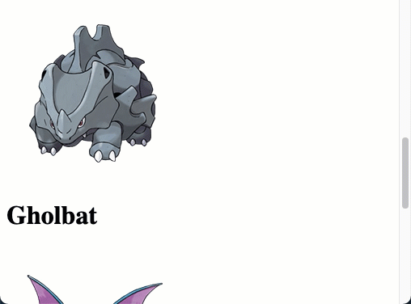

## Opdrachten

- Maak een nieuw bestand:
    - `pokeloop.php`
        - in de directory `public/03`
-  zet daar de standaard HTML structuur in
    - zet de PHP-code weer tussen de `<body></body>`.

## pokemons
- Maak een array `$pokemons` met minstens 5 [Pokemon namen]
    - zie (https://www.pokemon.com/nl/pokedex/)
- Maak nog een array `$images`
    - zet daarin de image url van de pokemon
        > HINT right-click op afbeelding, kopieer afbeeldings-url
- Zorg dat:
    - op index 0 in de `$pokemons` array de naam staat
    - en op index 0 in de `$images` de afbeeldings-url.

## For over de pokemon
- Schrijf een `for-loop` die telt van 0 tot de `lengte` van de array
    - HINT: `count`
- Gebruik in de loop `echo` en zet de naam tussen een `<h1></h1>` tag en de afbeeldings url in de `src` van een `` tag.
- Voeg wat `kleuren` en `stijlen` toe met een CSS-bestand
    - je style bestand moet in `assets/css/`

> Je hebt nu met een loop 5 of meer Pokemon characters en hun afbeelding op het scherm gezet in HTML.

## klaar
- commit alles naar je github