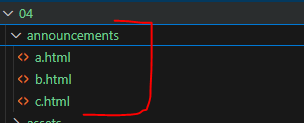
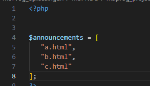
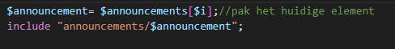
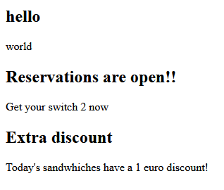
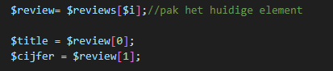

# Practische arrays

- Maak een nieuw bestand:
    - `array_include.php`
        - in de directory `public/04`
-  zet daar de standaard HTML structuur in
    - zet de PHP-code weer tussen de `<body></body>`.


## download

- download de files in announcements  
    - zet die in de folder `public/04`
        > 

## announcements

- maak een array boven in de file (boven de html):
    > 


- ga nu naar de php in de body
    - maak een for loop over $announcements
        - zet in de body van de for loop:
            > 
        
## test

- test je code:
    > 

## meer announcements

- maak nu 2 extra annoucements
    - voeg deze in de array


## andere array 


- maak nu een array (boven de html):
    - reviews
        - geef deze de volgende waardes achter de =
        ```php

        [
            ["demon's souls",10],
            ["mario wonder",9.5],
            ["mega man 2",8],
        ]
        ```

## review loop

- maak nu dit in de php in de body:
    > 
    
- gebruik echo om de review op het scherm te zetten:
    > 
    - test!

## conclusie

- voeg een conclusie toe aan je reviews
    > 


## klaar
- commit alles naar je github
