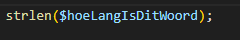
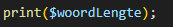

## Functions

- lees:
    > vaak gebruiken we stukken meerdere keren denk bijvoorbeeld aan:
    > - zet een string in de console/html (```print("hello world")```)
    > - rond een getal af (```round(2324.5)```)
    > - het toevoegen van een element in een array (```array_push(element)```)
    >   - print, round, array_push zijn functions.
    >       - functions van php zelf  
    > - wij maken daar dus gebruik van

## funcions gebruiken


- maak een nieuwe file:
    - `phpfunctions.php`
        - in de directory `public/05`


## woord lengte
- maak een nieuwe variable:
    - $hoeLangIsDitWoord
        - met waarde:
            - `"scrabbleWoord"`

- maak een nieuwe variable:
    - woordLengte
        - zet er een = achter

        - achter de = zet je:
            >
- zet nu woordLengte op het scherm met:
    >

## Test!

- test en kijk of je de lengte op het scherm krijgt:
    >

## function aanroepen

- lees:
    > Nu heb je de function strlen gebruikt:
    > - eerste typen we de naam `strlen`
    > - daarna de haakjes `()`
    > - en tussen de haakjes zetten we de argumenten die de function nodig heeft
    >   - in dit geval 1 string waarvan we de lengte willen weten


## vraag:

- kijk naar de documentatie van de function:
    > https://www.php.net/manual/en/function.strlen.php

- beantwoord de vragen hieronder, zet dit in commentaar in je code 
    ```php
    //dit is een voorbeeld
    //vraag 1: pow is een function die het kwardraat uitrekent
    ```

- vraag 1)
    - wat is het type het argument van strlen?
    
- vraag 2)
    - wat is het type van wat strlen returned?

- vraag 3)
    - het getal wat strlen returned, wat is dat?


## Eigen woord

- maak een nieuwe variable met een ander lang woord:
    - haal de lengte op net als hierboven
        > dus door de php function strlen te gebruiken
    - print die naar het scherm

- beantwoord de vragen hieronder, zet dit in commentaar in je code 
- vraag 4)
    - hoevaak heb je nu de function `strlen` aangeroepen?

## klaar
- commit alles naar je github
