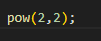
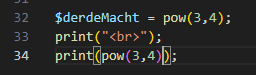

## oefenenen

- ga verder in `phpfunctions.php`

## power

- om 2 tot de macht van 2 te berekenen gebruiken we:
    >

- print nu onder aan in je code:
    - `" "`, dus een html linebreak
- daaronder maak je een variable:
    - tweeMacht2
        - met als waarde:
            >

## tot de macht ...
- lees:
    > als je machten niet kent in wiskunde:
    > - 1 getal is het getal
    > - de macht (exponent in het engels) is hoe vaak je het getal keer zichzelf doet
    >   voorbeeld:
    >   - 2 tot de macht 3:
    >   - 2* 2* 2= 8

- reken nu 2 tot de macht 10 uit:
    - gebruik `pow` EN de documentatie:
        > https://www.php.net/manual/en/function.pow.php)
- zet het resultaat weer met print op het scherm
    - controlleer:
        - het antwoord zou `1024` moeten zijn
        
## function resultaat naar een andere function

- lees:
    > tot nu toe deden we:
    > 1) maak variable
    > 2) geef die de return van de function
    > 3) geef de variable aan print mee
    > Nu gaan we DIRECT het resultaat aan print meegeven

- we gebruiken 3 tot de macht 4 hiervoor:
    > - we doen het 2 keer om het verschil te zien
    >

## vraag

- beantwoord deze vraag in code met commentaar:
    - vraag 1) 
        - hoe geven we het resultaat door? 
            > dus wat doen we?

## andere functions

- gebruik nu de function die een woord naar hoofdletters omzet
    > dus van `Mario` naar `MARIO`
    - deze heet `strtoupper`
        - zoek de function op in php.net
            - zet de link naar de documentatie in je code
- maak nu 2 variablen:
    - `naam`
        - met waarde:
            - `Wario`
    - `naamGroot`
        - met waarde:
            - de return van de function `strtoupper` als:
                - je `naam` meegeeft
    - zet `naamGroot` op het scherm met print

## terug naar klein

- zoek zelf de function op php.net om naar `kleine letter` te gaan
    - zet `naamGroot` om naar kleine letters
        - de return moet in een nieuwe variable:
            - `naamKlein`

    - zet `naamKlein` op het scherm met print
    - zet `naam` op het scherm met print

## klaar
- commit alles naar je github
