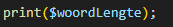

## oefenenen


- maak een nieuwe file:
    - `nagemaakt.php`
        - in de directory `public/05`


## eigen print function

- lees:
    > om een nieuwe function te maken typen we eerst:
    > - `function`
    > - daarna de `naam` van de function, bv: mijnFunction
    > - dan de argument haakjes `()`
    > - en als laatst de body haakjes `{}`  
    > zoals hieronder:
    ```php
    function mijnFunction()
    {
        //hier komt de code van de function
    }
    ```

- kopieer de code hierboven en verander de naam naar:
    - `mijnPrint`
- zet tussen de `{}`:
    >
    > - dus in de body!!


## Gebruiken

- test nu de nieuwe function:
    - roep de function aan in je code
        
        >
    - check je resultaat:
        >

- gebruik de function nog 2 keer:
    >

## Nuttig?

- lees:
    > - deze function is niet heel nuttig
    >   - omdat deze function altijd hetzelfde doet
    >   - en wat de function doet is niet nuttig
    >       - een sla bestand op function is bijvoorbeeld WEL nuttig
    > - vaak dit soort functions iets nodig tussen de `()`
    >      - dat heet een argument

- kijk naar dit plaatje van print:
    >
    - zie je hoe we tussen de `()` zetten WAT we willen printen?
        - zet tussen de `()` van mijnPrint:
            - $printText
                >
            - vervang "dit wordt mijn print" door:
                - $printText
                    > hier gebruiken we dus het argument

## TEST!

- test je php pagina:
    >
    - oops, dat klopt nog niet
        - vraag 1) lees de fout en bedenk je WAAROM het fout gaat, schrijf dit in commentaar in je code

## verbeteren:

- pas je code aan:
    >
- test en je krijgt:
    >

- zet nu je antwoord op vraag 1 OOK op het scherm
    >

## variable meegeven aan function

- lees:
    > - nu geven we elke keer een string mee
    > - we kunnen ook direct een variable meegeven
    >   - dan gebruikt de function de waarde van die variable
    >       - dit hebben we eerder gedaan met print:
    >           

- maak nu een variable:
    - dezeGaatMee
        - met waarde:
            - "deze waarde wordt meegenomen"
- gebruik mijnPrint om deze op het scherm te zetten:
    > 


## klaar
- commit alles naar je github
