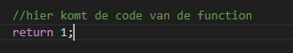
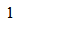

## oefenenen


- maak een nieuwe file:
    - `returns.php`
        - in de directory `public/05`

## Return

- kijk nog een keer naar deze code:

    > 
- lees:
    > - zie je dat pow achter de = mag staan?
    > - dat komt omdat pow een return heeft
    > - pow rekent de macht van iets uit
    > - en returned daarna het resulaat

- maak een nieuwe function volgens het patroon:
    ```php
    function mijnFunction()
    {
        //hier komt de code van de function
    }
    ```
- zet nu een return erbij in de body:
    > 
    - lees:
        > nu geeft onze function een 1 terug
        > - dat doet nog niet veel maar dat veranderen we later

## opvangen

- maak een nieuwe variable:
    - mijnFunctionResultaat
        - zet er een = achter
        - en achter de = roep je je function aan
## test

- print dan het resultaat: body:
    > 

## klaar
- commit alles naar je github
