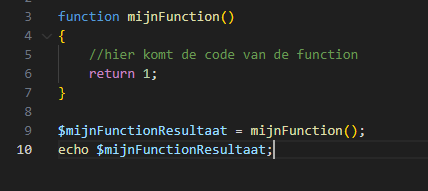
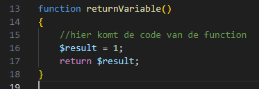
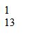
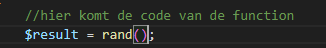
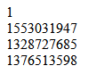
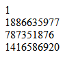

## oefenenen

- werk verder in:
    - `returns.php`

## return een variable

- check ook even je code:
    > 

- lees:
    > die vaste 1 is niet nuttig, maar als we er een variable van maken kunnen we die wel iets dynamischer laten werken
    > - bijvoorbeeld we hebben een variable met het resultaat van een berekening
    > - die we dan returnen

- echo eerst even een `<br>`:
```php

    echo "<br>";
```
- lees:
    > dit voorkomt verwarring in de cijfers door ze op aparte regels te zetten

## nieuwe function
- maak een nieuwe function volgens het patroon:
    > 

- zet het resultaat op het scherm
    - er staat nu 1 als het goed is

- verander nu de waarde 1 naar iets anders
    - test het weer!
        > 

- lees:
    > - nu hebben we nog steeds een vaste waarde
    > - alleen dan via een variable

- random
    - pas de regel van $result aan:
        > 

## test
- roep de function nu 3 x aan
    - met `<br>` echo's ertussen
- test:
    - nu krijg je 3 verschillende resultaten
    > 
    - en nieuwe als je de pagina opnieuw laad
    > 


## klaar
- commit alles naar je github
