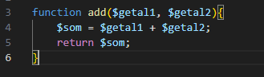
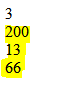

## oefenenen

- maak een nieuwe file:
    - `returncalc.php`
        - in de directory `public/05`

## Getallen optellen

- we gaan nu een function maken die getallen optelt
    > 

- lees:
> - nu hebben we niet een $result maar een $som
>    - maar ze hebben dezelfde rol => ze zijn het resultaat van de function

- roep nu de function aan en zet het resulaat op het scherm
    - kies zelf 2 getallen voor $getal1 en $getal2
    

- maak nu de sommen met de function add:
    > roep de function elke keer aan!
    - 100+100
    - 4+9
    - 33+33

## test

- check je resulaat:
    > 

## meer reken functions

- Voeg nu zelf 3 functions toe:
    - `subtract()`
        - zorg dat deze function
            - `2` getallen `van elkaar afhaalt` 
            - en het resultaat `returned`
        - roep de function aan en zet het resultaat op het scherm
    - `divide()`
        - zorg dat deze function:
            - `2` getallen `deeld` en `returned`
            - en het resultaat `returned`
        - roep de function aan en zet het resultaat op het scherm
    - `multiply()` 
        - zorg dat deze function:
            - `2` getallen `vermenigvuldigd` 
            - en het resultaat `returned`
        - roep de function aan en zet het resultaat op het scherm

        
## klaar
- commit alles naar je github
