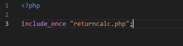
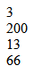

## oefenenen

- maak een nieuwe file:
    - `gebruikanderefile.php`
        - in de directory `public/05`

## Include

- lees:
    > - we kunnen ook andere php files includen
    > - meestal willen we dat maar 1 keer doen
    >   - dit voorkomt compiler errors

- zet het volgende in je `gebruikanderefile.php`
    > 

## test

- test je file
    > 
    - lees:
        > je laat nu alle code in "returncalc.php" in je nieuwe file
        > - daarom krijg je ook je echo's te zien

## weg met die echo

- commentarieer je echos
    - test, heb je nu een leeg scherm?

## klaar
- commit alles naar je github
