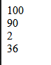
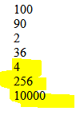

## oefenenen

- ga verder in:
    - `gebruikanderefile.php`
        - in de directory `public/05`

## function gebruiken

- gebruik nu in `gebruikanderefile.php` de functions uit `returncalc.php`: 
    > dit doe je net als wat je in returncalc deed!
    - add:
        - 60 + 40
    - subtract:
        - 100 - 10
    - divide:
        - 4 / 2
    - multiply:
        - 6 * 6

## test

- test je file
    > 
- klopt alles?

## tot de macht 2

- maak een nieuwe file:
    - `macht2.php`
        - in de directory `public/05`

- maak een nieuwe function
    - macht2
        - met tussen de `()`:
            - getal als argument

        - return:
            - het getal KEER zichzelf
                > getal*getal

# INCLUDE

- open:
    - `gebruikanderefile.php`
- haal `macht2.php` erbij met include_once

- test je macht2 function met de volgende getallen:
    - 2
    - 16
    - 100
    
- controlleer je resultaat:
    > 
    
## klaar
- commit alles naar je github
