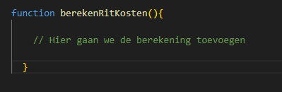
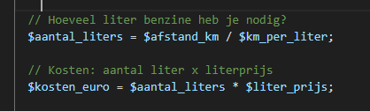

# Functions met input argumenten

- lees:
  > Een function is meestal een stuk interessanter wanneer deze input ontvangt om mee te werken.  
  Denk aan het berekenen van iets (celsius naar fahrenheit) of het aanpassen van iets (naam naar hoofdletters) etc.    
  > Bedenk eerst een function wel echt nodig en handig is. De function hier  onder bijvoorbeeld is niet echt handig. De function heeft geen input en  doet altijd hetzelfde, hoe vaak zul je deze function gebruiken? 

  ```php
  function tweePlusTwee(){
      $resultaat = 2 + 2;
      return $resultaat;
  }
  ```

## Stappenplan om zelf een function te schrijven

- lees: 
  > Het is belangrijk dat je GOED nadenkt over HOE jij wilt dat de function functioneert.

  > - Wat doet de function? Wat voegt het schrijven van de function toe?
  > - Wat is een duidelijke naam voor de function?
  > - Welke input argumenten heeft de function nodig?
  > - Welke output of return waarde heeft de function? 

### Opdracht: Function schrijven voor de reiskosten opdracht

- open je 03/reiskosten.php
  - werk hier NIET in, maar de code heb je nodig:
    > Je hebt daar de code geschreven voor het berekenen van de kosten van een autorit naar Bordeaux. Die code kunnen we een function voor schrijven. Zo kun je de kosten voor een reis naar een andere bestemming makkelijk berekenen volgens dezelfde berekening.


### Stap 1 - Schrijf het basis function patroon in code op


> Bedenk wat een duidelijke naam is die beschrijft wat de function doet. De function `doetIets()` en `voeruit()` zeggen niets over wat de function doet bijvoorbeeld.   

> - Laten we de function `function berekenRitKosten()` noemen.

#### DOEN:

- open je `functions.php`
- schrijf de volgende code in je `functions.php`
  >   
  > dit is de basis opzet

### Stap 2 - Wat heeft de function nodig als input?

> Bedenk eerst wat de function nodig heeft (welke input argumenten) om de berekening te kunnen uitvoeren.

> - De afstand in kilometers, laten we die `$afstand_km` noemen
> - Het verbruik van de auto (hoeveel kilometer rijd je met 1 liter > benzine), laten we die `$km_per_liter` noemen
> - De prijs voor een liter benzine: `$liter_prijs`

#### DOEN:
- het het volgende in de function als argumenten:
  - `$afstand_km, $km_per_liter, $liter_prijs`  
  > Dus tussen de `()` die achter `berekenRitKosten` staan

### Stap 3 - Wat geeft de function als output of resultaat?

> Bedenk nu: Geeft de function iets terug of niet? Als de function iets terug moet geven dan kun je dat met `return` teruggeven. 

> - De function geeft de kosten in euro's terug. Laten we de return waarde dus `$kosten_euro` noemen.
> - Dit is waarschijnlijk een getal met cijfers achter de komma, dus een `float`.

#### DOEN:

- schrijf onder `// Hier gaan we de berekening toevoegen`:
  - `$kosten_euro = 0;`
- een function geeft terug door een `return`
  - zet nu aan het eind van de function (voor `}`):
    - `return $kosten_euro;`

### Stap 4 - Schrijf nu de code voor de function

De function berekent nu nog niets. Hieronder staat de code die de berekening doet met de input

- zet de code hieronder in de function boven de `return`:
  >


### Opdracht: Gebruik de function in je code


#### Voorbeeld gebruiken:

> om onze function te gebruiken moeten we het volgende bedenken:
> - welke `input` (`argumenten`) heeft de function nodig?
>   - wij hadden `$afstand_km, $km_per_liter, $liter_prijs`, in `DIE volgorde`
> - geeft de function iets terug?
>   - in ons geval `JA` dus moeten we het opvangen in een `variabel`
>     - het patroon is dan `$variableOmInOpTeVangen = functionDieIetsReturned()`

```php
// Stel, je gaat een reis van 500 km maken, in een auto die 1 op 20 rijdt en een liter benzine kost € 2.45
// Dan kun je de function zo aanroepen en de kosten opslaan in een variabele
$kosten = berekenRitKosten(500, 20, 2.45);

// Voor een reis van 1200km, auto die 1 op 10 rijdt en een bezine prijs van 1.89
$kosten = berekenRitKosten(1200, 10, 1.89);

```

#### DOEN:


- open `script.php`
  - reken daar de volgende ritkosten uit door de function aan te roepen.

    > - Autorit naar Berlijn (663 km), auto verbruikt 1 liter elke 15 km, > literprijs benzine is € 1.90
    > - Autorit naar Stockholm (1438 km), auto verbruikt 1 liter elke 20 km, > literprijs benzine is € 1.46
    > - Autorit naar Kiev (1991 km), auto verbruikt 1 liter elke 18.47 km, literprijs benzine is € 2.23

- Zet elke keer het resultaat op het scherm. 
- Gebruik de ingebouwde php function `number_format()` om:
  - de prijs met 2 cijfers achter de komma op het scherm te zetten 
    > [lees de documentatie](https://www.php.net/manual/en/function.number-format)


## TESTEN

- Vraag de pagina op via localhost
- Voeg wat `kleuren` en `stijlen` toe te voegen met CSS zodat het er prettig uit ziet.
  

## klaar
- commit alles naar je github


