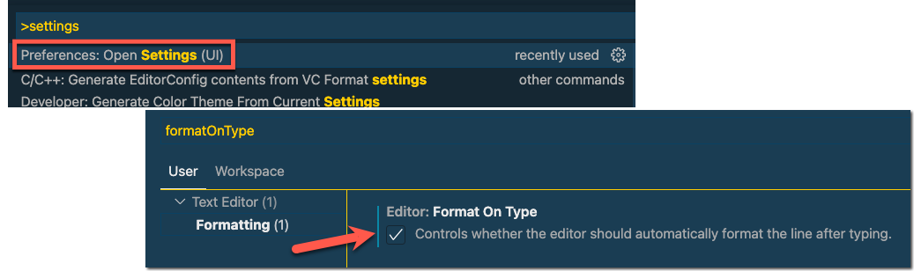
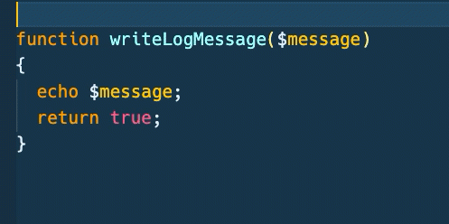
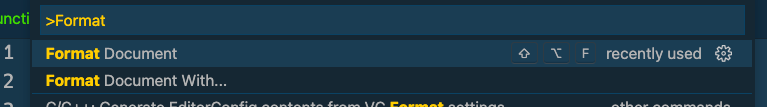
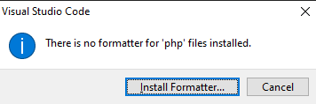
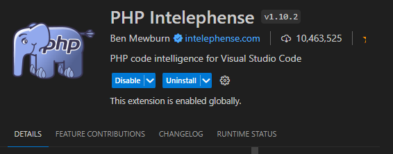

# Je functions documenteren

>Leer jezelf aan om je code te documenteren. 

- Schrijf een `docblock` boven je function definitie 
    - zie lesslides of zoek maar voorbeelden
- Schrijf `eenregelige` comments bij stukken code om uit te leggen wat de code doet

### Visual Studio Code instellen

Zorg dat je deze instelling goed hebt staan, zodat je makkelijk een `docblock` kunt maken

- Ga naar `View` > `Command Palette`
- Ga naar `Preferences: Open Settings (UI)`
- Zoek naar `formatOnType`
  - en klik de checkbox aan

### Opdracht 1 - Docblocks toevoegen

- Open je `functions.php` bestand die je in deze les hebt gemaakt 
    - die staat in de directory `public/04`
- Maak voor elke functions een `docblock` met:
  - Korte beschrijving wat de function code doet
  - De beschrijving van de parameters en het data-type van elke parameter
  - De return waarde en het datatype van de return waarde

### *extension nodig???? TODO* 
Je maakt een docblock door op de regel boven de function te gaan staan en `/**` boven de function te type en dan op enter te drukken.
Daarna kun je alles goed invullen

### Opdracht 2 - Code formatteren (mooi uitlijnen en opmaken)

- Zorg dat je vanaf nu je code `formatteert` voor je het opslaat, zodat de code goed `inspringt` en er `gestructureerd` uit ziet. 
Dit helpt ook bij het lezen van de code.

> **In Visual Studio Code kun je dit doen door:**
> 
>- Bovenin het menu naar View > Command Palette te gaan
>- Dan "Format" te typen 
>- Format document te kiezen

- formateer al je `php` files
  - Het kan zijn dat je het volgende krijgt:
    > 
    - installeer dan de formatter:
      > 

## klaar
- commit alles naar je github