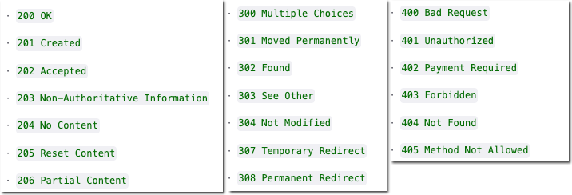
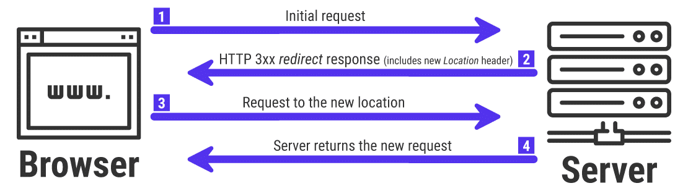

# HTTP Status codes

> In de vorige opdracht heb je een request en response geïnspecteerd. Belangrijk daarbij is de `HTTP Status code`.
Dit is een 3-cijferig getal. Hiermee kun je bepalen of een request gelukt, of als er iets fout gaat.

> Je kent de status code `404` wel. Dit betekent: `De opgevraagde URL (pagina) bestaat niet`.
De status `200` Betekent: `OK`, Alles is goed gegaan in de communicatie tussen client en server en er is een correct antwoord gegeven door de server.

> Hier vind je een overzicht van belangrijke [HTTP status codes](https://developer.mozilla.org/en-US/docs/Web/HTTP/Status) en hun betekenis. 

> - Een status code tussen de [200 en 299](https://developer.mozilla.org/en-US/docs/Web/HTTP/Status#successful_responses) terugkrijgt van de server, dat er dan geen probleem is.
> - Een status code tussen de [300 en 399](https://developer.mozilla.org/en-US/docs/Web/HTTP/Status#redirection_messages) betekent dat je wordt doorgestuurd naar een andere pagina (redirect)
> - Een status code tussen [400 en 499](https://developer.mozilla.org/en-US/docs/Web/HTTP/Status#client_error_responses) betekent dat de client iets niet goed heeft gedaan (verkeerde url opgevraard bijvoorbeeld?)

> Krijg je een code die tussen de [500 en 599](https://developer.mozilla.org/en-US/docs/Web/HTTP/Status#server_error_responses) ligt dan is heeft de server een probleem (fout, crash, bug).

**Om een lang verhaal kort te maken...**

> Een status code geeft informatie over het resultaat van een request naar de server. Het helpt je bij het `opsporen van fouten`.  
Eigenlijk is het programmeren van websites niets anders dan vanaf de server een antwoord (response) geven op een request (verzoek) van een browser (de client) op een bepaalde URL. 

### Opdracht 1 - Met PHP een 404 status code sturen

> Omdat PHP op de server wordt uitgevoerd kun je met PHP ook een `response header` sturen met een bepaalde code.

- Maak een bestand `hdr404.php`
    - in de directory `public/05`
- Lees in : https://www.php.net/manual/en/function.header.php hoe je een response header kunt terugsturen met het de `header()` function
    > - Belangrijk: je mag geen inhoud op het scherm zetten voor je de header stuurt!
- Stuur met het de `header()` function een 404 header
- Vraag het PHP-script op via je `localhost` en inspecteert de headers met de web inspector
- Wat zie je? Maak een screenshot en zet hem bij het PHP-bestand.
    - noem het screenshot `05 404.png`
        - zet deze in je `screenshots` directory

### Opdracht 2 - Met PHP en een 302 status code de client doorverwijzen

- Maak een nieuw bestand:
    - `hdr302.php`  
        - in de directory `public/05`

> Met een 302 response code kun je de client doorsturen naar een andere URL. Dit noem je een *redirect*.

- Zoek op in de [PHP-documentatie](https://www.php.net/manual/en/function.header.php) en/of [Google](https://www.google.com/search?q=header+location+redirect+302+php) hoe je met PHP een `Location` header kunt sturen die de client doorstuurt naar een andere URL
- Stuur een `Location' met 302 status code
- De `Location` header geeft de client een URL om naar toe te gaan. 
- Stuur de gebruiker dus door naar een andere website (kies zelf een eigen URL).
    - bv een `rick roll` 
    - grapje mag maar het moet wel veilig en netjes zijn
- Vraag de `hdr302.php` pagina op via jouw `localhost` en test of je wordt doorgestuurd.

> De 302 status code gebruik je bijvoorbeeld als een formulier is opgestuurd en afgehandeld. Het is belangrijk om de bezoeker van je website direct door te sturen naar een bedankt- of resultaat pagina.
Als de bezoeker de pagina dan per ongeluk ververst wordt het formulier niet (per ongeluk) opnieuw verwerkt, je zit dan gelukkig al op de bedankt pagina.

> Alles over het [HTTP-protocol](https://developer.mozilla.org/en-US/docs/Web/HTTP) (en nog veel meer handige informatie over web development) vind je op [de Mozilla Developers Network website](https://developer.mozilla.org/en-US/docs/Learn). 

## klaar
- commit alles naar je github

