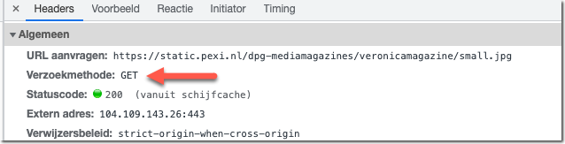
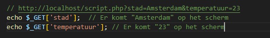
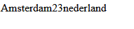
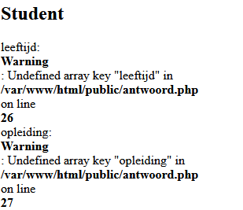
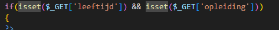
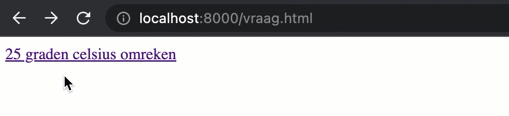

# GET data lezen uit de URL

> Er zijn twee belangrijk `HTTP methodes` om gegevens `NAAR` de `server` te sturen: `GET` en `POST`.

> De `GET` methode gebruik je om gegevens op te halen van de server. Als je de URL van een website in je browserbalk typt noem je dat een GET request.
Dit heb je als het goed is al gezien bij het inspecteren van een request:




> In je PHP script is hiervoor een `speciale variabele` die `ALTIJD` beschikbaar is: `$_GET`. Deze variabele bevat een `associatieve array` 
>   - dus een array die met key-value pairs werkt
>       - $waardeDieBijDeSleutelHoort = $mijnArray["sleutel"];
>
> De `$_GET` array bevat alle extra parameters die je aan een URL kunt meegeven.  
>
> Deze URL: 
> - `http://localhost:88/05/querystrings.php?stad=Amsterdam&temperatuur=23`  
>   - bevat 2 *GET parameters*:
>       - `stad`
>       - `temperatuur`.
>
> Via de `$_GET` variabele kun je in `script.php` de value uitlezen voor elke parameter:
> 

#### DOEN:

- maak een nieuwe file:
    - `querystrings.php`
        - in de directory `public/05`
- maak dat nu na:
    > 
    - open `http://localhost:88/querystrings.php?stad=Amsterdam&temperatuur=23` 
        - zie je `Amsterdam` en `temperatuur`?
        > 

**Via de URL kun je een script op die manier input geven!**
- voeg nu ook `land` toe en laat die zien
        - zie je `Amsterdam`,`temperatuur` en `land`?
        > 

    - maak het netjes op met html
    - maak een screenshot:
        - `05 querystring.png`
            - zet deze in je `screenshots` directory

### Opdracht 1 - Gegevens uit de URL lezen via $_GET

- Lees hier nog eens goed door hoe je die `$_GET` gegevens kunt uitlezen:
    - https://www.w3schools.com/php/php_superglobals_get.asp 
- Maak eerst twee bestanden:
    - `vraag.html`
    - `antwoord.php`
    - in de directory `public/05`

- zet de standaard html structuur in `vraag.html`
- Maak in `vraag.html` een HTML-document met deze link:

```html
<a href="antwoord.php?leeftijd=17&opleiding=SD">Toon gegevens</a>
```

- open `antwoord.php`
    - Lees via de `$_GET` variabele:
        - `leeftijd`
        - `opleiding`
- Zet de gegevens op het scherm.

- Voeg een `tweede` link toe in `vraag.html` naar `antwoord.php` met andere GET-parameters.
    > verander dus `leeftijd` en `opleiding` in iets anders
    - open je `vraag.html` in je browser en click op de tweede link
    - krijg je fouten?
        > 
        - los dat op door te controlleren of de `key` bestaat:
        > 
        - doe dat ook voor de tweede vraag

> Tip: Gebruik `print_r($_GET);` om te kijken wat er in de `$_GET` array variabele zit.

### Opdracht 2 - De GET-input gebruiken om een temperatuur om te rekenen

- Maak een bestand:
    - `fahrenheit.php`
    - `fahrenheit.html`
    - in de directory `public/05`
- Voeg nu een link toe aan `fahrenheit.html`

```html 
<a href="fahrenheit.php?celsius=25">25 graden Celsius naar Fahrenheit omreken</a>
```
 
- Pak je berekening van celsius naar fahrenheit uit les 2 er bij
- Lees de waarde van `celsius` uit via `$_GET` en zet de waarde in een variabele `$input`
- De variabele is nog string (en geen getal)
- Gebruik nu `$celsius = floatval($input)` om er een float van te maken.
- `Bereken` nu de `temperatuur in fahrenheit`
    - zet op een duidelijke manier op het scherm:
        - wat de temperatuur in celsius is 
        - en de temperatuur in fahrenheit
- Voeg nog wat links toe naar `fahrenheit.php` maar met andere waarden voor de celsius parameter
- Verander in de `URL` van je browser de waarde van `celsius` in een andere temperatuur. Verandert de output?

    > 

> Je hebt nu één script gemaakt die verschillende Celsius temperaturen kan omrekenen naar Fahrenheit.

## EXTRA challenge

- maak een nieuwe file
    - `fahrenheitPerDegree.php`
        - in de directory `public/05`
    - gebruik een for loop om links te maken voor:
        - alle graden celsius van 0-45

## klaar
- commit alles naar je github

## INFO
Links:

- [De superglobal variabelen in PHP](https://www.php.net/manual/en/language.variables.superglobals.php)
