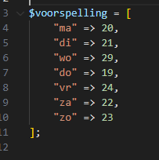
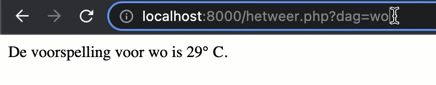
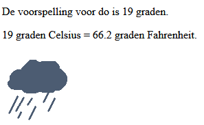

# GET data - deel 2

> Je kunt de waarde van een GET-parameter ook gebruiken om bijvoorbeeld iets uit een array in je PHP-script te lezen.

### Opdracht 1 - Een GET-parameter gebruiken om iets uit een associatieve array te lezen 

- Maak een nieuw bestand `hetweer.php`
    - in de directory `public/05`
- Zet hier deze associatieve array in (tussen de PHP-tags!):
> 

- zorg ervoor dat je met $_GET:
    - de juiste temperatuur op het scherm krijgt door deze URL op te vragen
    > bijvoorbeeld
    > - `hetweer.php?dag=ma`
    > - `hetweer.php?dag=wo`
    > 

### Opdracht 2

- Maak een tweede associatieve array met dezelfde *keys*
    > - (ma, di, wo enzovoorts)
- Zet urls in naar weer-icoontjes die bij die dag horen
    - gebruik deze icoontjes [icons](icons).
    - zet deze onder `assets/images`
- Lees de juiste `afbeeldings-url` voor de opgevraagde dag uit de tweede array 
- Gebruik een `` tag om het icoon er ook bij te zetten
- Maak er een `mooie pagina` van met behulp van je frontend skills
- Lukt het je om ook de temperatuur in fahrenheit uit te rekenen en die er bij te zetten?

> 

#### UITLEG

> Je hebt nu een aantal zaken gecombineerd uit de afgelopen lessen:
> 
> - Associatieve Arrays
> - PHP en HTML combineren
> - echo gebruiken 
> - GET-parameters uitlezen via de speciale $_GET variabele
> - Berekeningen uitvoeren

## klaar
- commit alles naar je github
