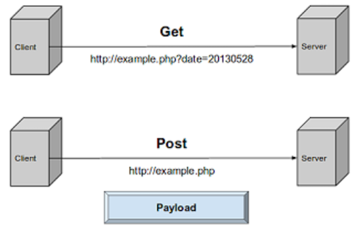
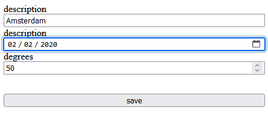
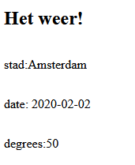

# POST methode gebruiken



> De `GET` method is handig, maar is niet altijd een veilige keuze. De verstuurde gegevens zijn namelijk zichtbaar in de URL. Niet zo fijn als je wachtwoord in de URL staat en iemand je browser history bekijkt :-(
>
> Met de HTTP POST-methode stuur je gegevens NAAR de server. Dit gebruik je als je een ingevuld formulier opstuurt naar de server.
> 
> Hieronder staat een simpel formulier in HTML

```html
<form action="verwerk.php" method="POST">
  <label>Wat is je voornaam?</label>
  <input type="text" name="voornaam">
  <button type="submit">Opsturen</button>
</form>
```

- In het `action` attribuut zet je de naam van het PHP-bestand waar de gegevens naartoe gestuurd moeten worden.
- De `method` zet je op `POST` 
  - als je er `GET` van maakt... waar zie je gegevens dan, denk je?
- De `name` van de input.
- Er `MOET` een submit knop zijn, deze verstuurt het formulier.

> In het voorbeeld formulier wordt de ingevoerde voornaam doorgestuurd met als `name`: `voornaam`.
> - dit is weer een key-value pair:
>   - key = name
>   - value = voornaam
>
> Voor het uitlezen van POST gegevens is er de speciale `$_POST` variabele in PHP.
> 
> In `verwerk.php` (daar worden de gegevens van dit formulier heen gestuurd) kun je de `$_POST` array uitlezen:

```php
  // Zo toont je wat je hebt ingevuld in de input met name="voornaam"
  echo $_POST['voornaam']; 
```

### Opdracht - Stuur een formulier op via de POST-methode 

> Je gaat nu een formulier maken en opsturen met de POST methode naar een PHP-script op de server. Je probeert ook wat verschillende form velden uit.

[Hier vind je allerlei soorten input velden en voorbeelden](https://www.w3schools.com/html/html_forms.asp)

- Maak een bestand:
  - `formulier.html`
    - in de directory `public/05`
  - zorg voor een HTML-structuur 
  - voeg een `<form>` in de `<body>` toe

- Maak een tweede bestand:
  - `verwerk.php`.
    - in de directory `public/05`
- Stel de `action` van je form in naar:
  - `verwerk.php`
- gebruik `POST` als `method`.

- Maak een formulier om het weerbericht in te voeren.
- Voeg minstens `3 verschillende` soorten formulier velden toe aan je formulier
  > - Bijvoorbeeld:
  >   - een tekst veld 
  >   - een date veld
  >   - of een select (dropdown menu) met options? (kies zelf)
- Geef elke input een duidelijke label met instructies ([gebruik CSS voor opmaak van je form](https://www.w3schools.com/css/css_form.asp))
- Geef elke input een `name` attribuut met een duidelijke naam (kleine letters geen spaties!)
- Voeg een submit button] toe 

- Lees nu in `verwerk.php` de gegevens uit de `$_POST` array 
- Gebruik de `name` van het invoerveld hiervoor
  > - TIP check je html!
- Vul het formulier in en stuur het formulier op
  - kijk of je bij `verwerk.php` aankomt.
- Zet de ingevoerde gegevens mooi op het scherm.
- maak een screenshot:
  - `05formulier.png`
    - zet deze in je `screenshots` directory

> Tip: Gebruik `print_r($_POST)` om inhoud van de hele `$_POST` array op het scherm te zetten.

> bijvoorbeeld:
>
> 
> 

## klaar
- commit alles naar je github


## INFO
Links / tutorials:

- [Alles over forms](https://developer.mozilla.org/en-US/docs/Learn/Forms)
- [Your first form](https://developer.mozilla.org/en-US/docs/Learn/Forms/Your_first_form)
 
