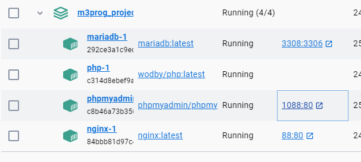
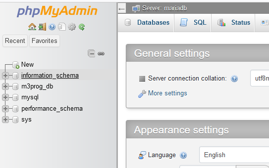
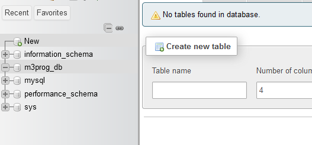
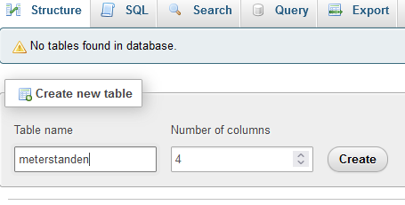
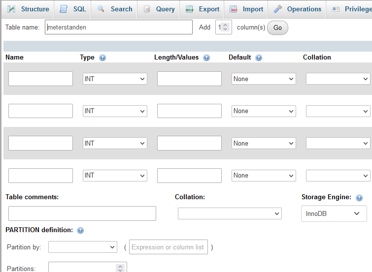
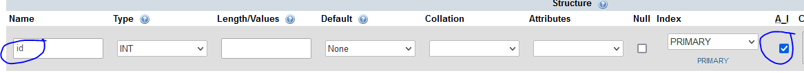
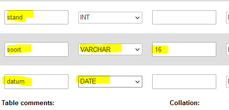
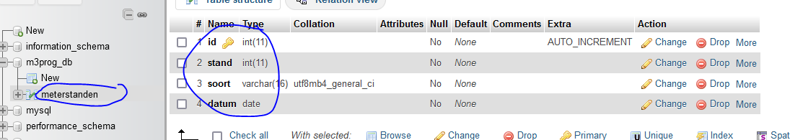

# Database

> Een database is een opslagplek voor gegevens. Bij jouw docker zit een MySQL database.

- open je `docker-compose.yml`
    - kijk naar je `# MariaDB Service`
        - zie jij je database, user en password staan?
            > letop! er staan 2 passwords!
            >   - 1 van de root (super rechten `DANGER`)
            >   - 1 van de applicatie (voor je php)

### Database maken voor meterstanden / energieverbruik

> Om de databases van jouw MySQL database server te kunnen zien en beheren gebruik je voor nu `phpMyAdmin`.

- open je docker desktop
    - klap je `m3prog_project` stack open
        > 
        - zie je je `phpmyadmin` container?
            - zie je die `1088:80` staan?
                - click daarop!
                - krijg je je `phpmyadmin` te zien?
                    > 
  
- We gaan naar onze database `m3prog_db`
    - click daarop
        - je ziet nog niets!
                    > 
## Tabel maken

> voor nu gebruiken we phpmyadmin om grafisch tabellen te maken, later moet je dit ook met SQL statements kunnen

- vul onder `create new table` de tabelname in:
    - `meterstanden`
        > 
    - `CHECK` dat er ook `4` coloms/kolommen staat!
- je krijg nu dit scherm:
    > 
- maak een id colom en vink de juiste dingen aan:
    > 
> dat checkboxje `A_I` betekent `auto_increment`  
> dat doen we vaak voor `id's` van het type `int`:
> - de database zet daar `automatisch` een `waarde` dan in `voor elke rij` die je `toevoegd`

- vul nu de andere 3 in:
    > 
    - druk nu op `save`
- nu krijg je dit:
    > 

- maak daar een screenshot van:
    - `06database.png`
        - zet deze in je `screenshots` directory

## docker

- als je je `docker stack` weggooit gaat je database ook weg.
    - Dus we willen dat snel kunnen herstellen
    - ga naar de tab `export`
        - druk op `export`
        - je download nu een `meterstanden.sql`
            - zet die in `M3PROG` directory waar je `git` begint

## klaar
- commit alles naar je github

