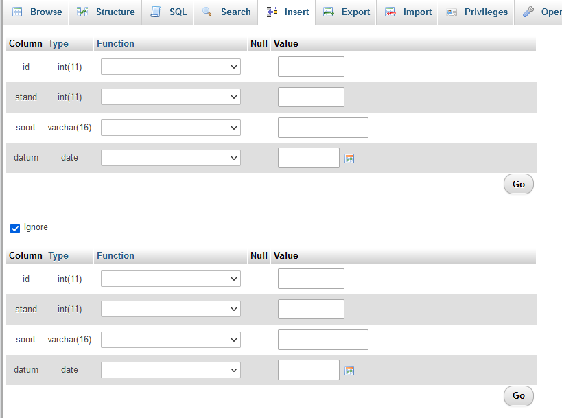
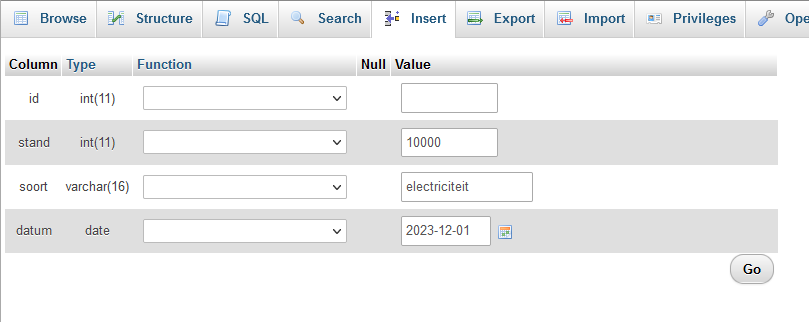
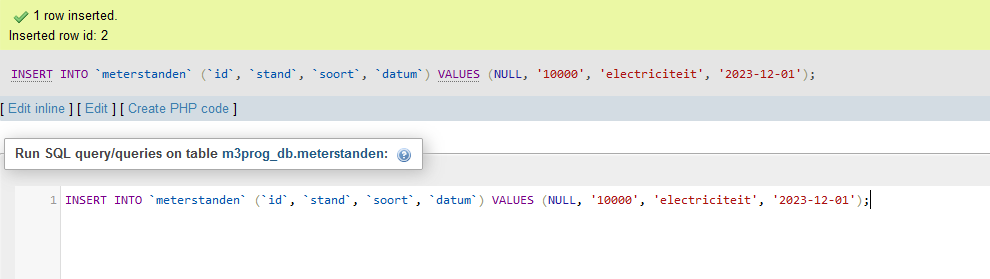
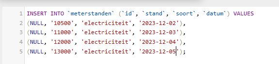
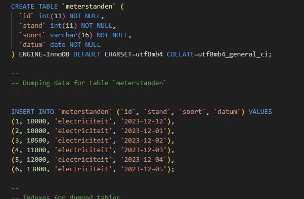
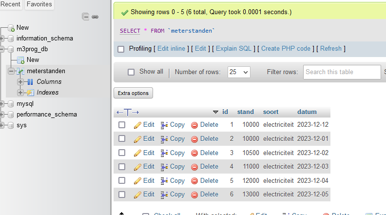

# Meterstanden invoeren

> Nu je een database en table hebt voor de meterstanden, kunnen we de meterstanden gaan invoeren

- ga naar de tab `insert`
    > 

- Pak jouw meterstanden er bij
    - voer `1 stand` in (laat `id` leeg)
    - druk op `go`
        > 
    - nu krijg je dit te zien:
        > 
    
## meerdere inserts

- op dat scherm passen we nu iets aan:
    > 
    - zo kan ik meerdere rijen toevoegen
        > data scheelt werk
    - voer nu zoveel mogelijk in via `phpMyAdmin`.
        > Hoe meer data je hebt, hoe mooier je grafiek wordt op je dashboard

## docker en export

- maak nog een export
    - zo stel je de data ook veilig:
    > 
    - sla de `meterstanden.sql` die je net gedownload hebt ook op in je git

## select

- click nog een keer op de `meterstanden` tabel
    > 
    - zie je de data?
    - maak een screenshot:
        - `06data.png`
            - zet deze in je `screenshots` directory

## klaar
- commit alles naar je github

