# Meterstanden op halen uit de database

- maak een nieuwe file:
    -  `meterstanden.php`
        - in de directory `public/06`
    - kopieer je code uit  `connectiontest.php` naar
        - `meterstanden.php`
    
## SQL aanpassen

- die `SELECT 1` gaan we vervangen met de query tussen de `""` hieronder:
    > 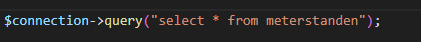
- open je `meterstanden.php` en controlleer of je ze op het beeld ziet:
    > 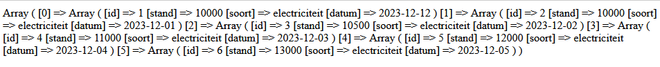

## opruim

- haal je fetch all weg met commentaar:
    > 
- verander de volgende code
    > 
    - naar:
    > 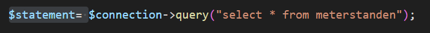

## Rij voor Rij

> vaak willen we dingen `rij` voor `rij` inlezen

- maak onderaan (`na` je php sluit tag `?>`)in je `meterstanden.php` een html opzet
    > HINT: `!` in visual studio code  
    > 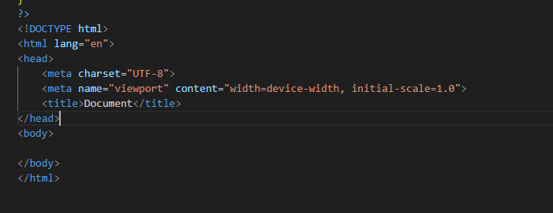
- In de body gaan we weer naar `php`:
    > 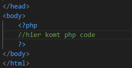

- nu gaan we daar een `for loop` in maken:
    > we gebruiken nu de `foreach` variant dat is ook een `for loop`
    > 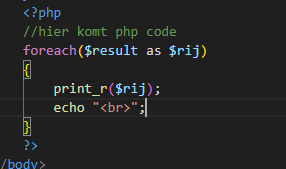
    
- test en kijk of je zoiets krijgt:
    > Netter toch?
    > 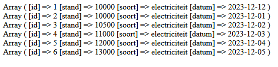

## Html opmaken

- we gaan nu naar mooie html verander je loop:
    > 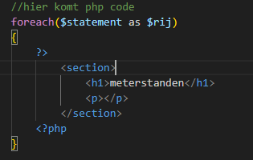
> - om iets net op te maken gebruiken we de `<?= ...?>`
> op de `...` vul `JIJ` in wat je `geprint` wil hebben, in ons geval iets uit `$rij`

- neem het volgende over:
    > 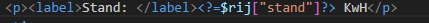
> die `$rij["stand"]` is weer het `ophalen` met een `key` uit een `associative array`

- zie je nu zo iets:
    > 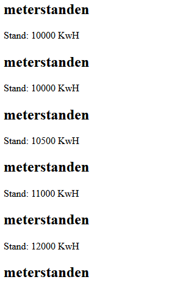

## Afmaken

- Maak het nu af zodat het er zo uit komt te zien:
    > 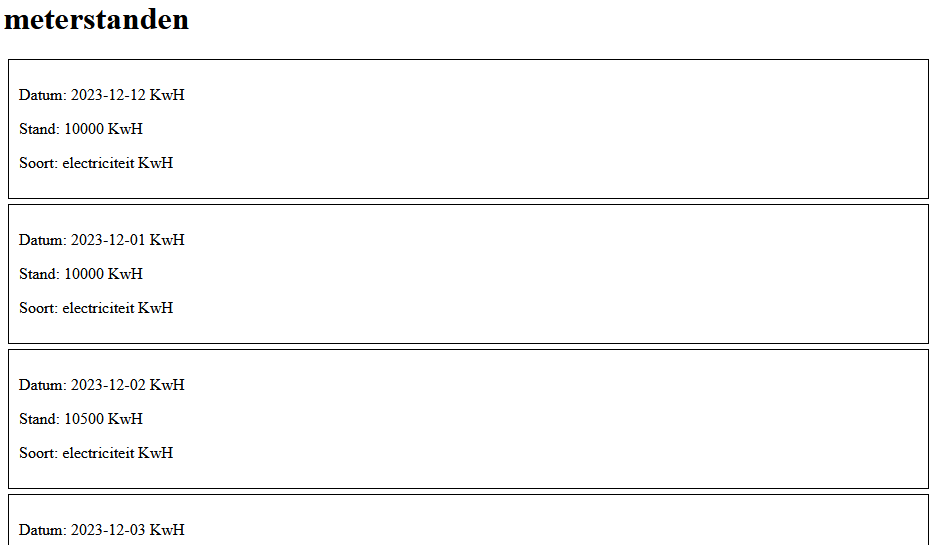

## klaar
- commit alles naar je github

