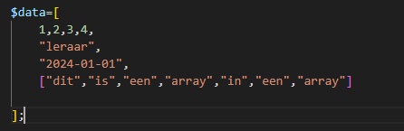

# Een array naar JSON omzetten

> HTML gebruik je om een webpagina op te maken en te structureren, maar is niet handig als je data wilt verwerken.
Een veelgebruikte data structuur is JSON. Je gaat zo eerst een array naar JSON omzetten om te zien hoe dat werkt.

> Zo ziet JSON er uit. Het is gewoon tekst, maar wel in een gestructureerd formaat. Zo kun je het makkelijk omzetten naar een
Object in Javascript.


```json
{
  "voornaam": "Max",
  "achternaam": "Verstappen",
  "beroep": "Formule 1 coureur",
  "woonplaatsen": [
    "Monaco",
    "Hasselt"
  ]
}
```

> Je ziet dat het heel erg lijkt op een Array in PHP EN op een Object in Javascript.

## Data klaarzetten

- maak een nieuwe file aan:
  - `json.php`
        - in de directory `public/06`
  - maak daar een `php begin tag` in

- zet daar het volgende in:
  > 

## Een array omzetten naar JSON

- nu gaan we code toevoegen om de `$data` array om te zetten naar een `json string`, neem dit over:
  > zo kunnen we data uit het geheugen versturen als text!
  > 

## testen

- open nu `json.php` in je browser (vergeet docker niet aan te zetten)
  - check of je dit ziet:
    > 

## request inspecteren

- open je web developer tools
  - ga naar netwerk
    - open de request van `json.php`
      - bekijk de response headers
        > 
      > hier zie je `text/html` staan, maar we versturen `json`?
      > de `content-type` header is belangrijk, die moeten we goed zetten

## header goedzetten

- neem nu de `header regel` in deze code over:
  > 
- test nog een keer
  - je hebt nu hetzelfde toch?

- verander nu `text/html` in `application/json`:
  - nu krijg je:
  > 

> zie je dat de browser de data nu anders toont?
> als je bijvoorbeeld een plaatje terugstuurt, heb je weer een andere Content-Type nodig.   
>We vullen daar `Mime types in`
> - https://developer.mozilla.org/en-US/docs/Web/HTTP/Basics_of_HTTP/MIME_types/Common_types


https://www.youtube.com/watch?v=WV5Oi-ufxTQ
## klaar
- commit alles naar je github


## INFO

Meer informatie over JSON:

- [https://www.w3schools.com/js/js_json_intro.asp](https://www.w3schools.com/js/js_json_intro.asp)
- [https://developer.mozilla.org/en-US/docs/Learn/JavaScript/Objects/JSON](https://developer.mozilla.org/en-US/docs/Learn/JavaScript/Objects/JSON)
- [JSON Linter - kijken of JSON geldig is](https://jsonlint.com/)


