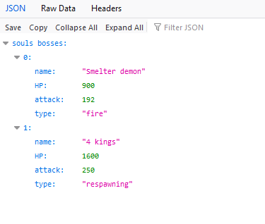

### Een API kiezen

- Ga naar deze pagina: 
    > - [https://developer.vonage.com/blog/2021/03/15/the-ultimate-list-of-fun-apis-for-your-next-coding-project](https://developer.vonage.com/blog/2021/03/15/the-ultimate-list-of-fun-apis-for-your-next-coding-project). 

> Hier staan een heleboel gratis API's die je kunt gebruiken. Sommige zijn nogal onzinnig, maar zijn prima om te gebruiken om code te oefenen.

> Let op, sommige API's kun je alleen met een API-key gebruiken, hiervoor moet je je registreren. 

- Kies daarom één van onderstaande API's om mee te oefenen:
> - Bored API (deze ga ik gebruiken in mijn les en video's)
> - REST Countries
> - Pokemon API
> - Kanye Rest API

# Een request doen

> We gaan straks een request down met onze `browser` naar een `API` die `JIJ` kiest

>Hier een paar websites met links naar API's die je kunt gebruiken:
> - [https://developer.vonage.com/blog/2021/03/15/the-ultimate-list-of-fun-apis-for-your-next-coding-project](https://developer.vonage.com/blog/2021/03/15/the-ultimate-list-of-fun-apis-for-your-next-coding-project)
> - [https://apilist.fun/](https://apilist.fun/)
> - [https://www.programmableweb.com/category/humor/api](https://www.programmableweb.com/category/humor/api)

Zorg dat je een API gebruikt waarvoor je geen API key nodig hebt, of waarvoor je niet hoeft te registreren, dat is het makkelijkst.

**Lees de documentatie van de API, daar staat in hoe je deze API moet aanroepen, welke URL's je gebruikt etc.**

### Opdracht 

- Ga naar de documentatie van de API van jouw keuze en:
    - zoek op hoe je de API moet aanroepen
    > - Meestal zie je een voorbeeld in de documentatie
- Vraag de `URL` op in je `browser` 
    > dit kan als de documentatie zegt dat het een `GET` request is
- Kijk of je JSON op je scherm krijgt
    > 

    
## screenshot
- maak een screenshot van je resultaten:
    - `apiresultbrowser.png`
    - zet deze in je `screenshots` directory

## nog 2 keer

- vraag nu nog `2x` een `ander` stuk data op  
    - maak een screenshot van elk resultaat
        - `apiresultbrowser2.png`
        - `apiresultbrowser3.png`
        - zet deze in je `screenshots` directory

## klaar
- commit alles naar je github