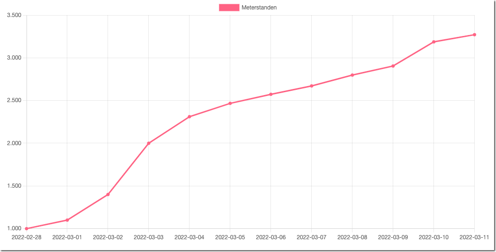
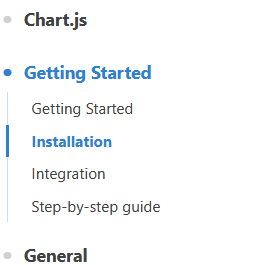
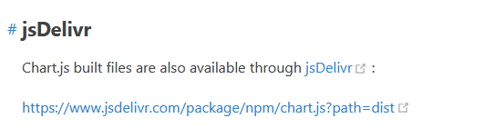
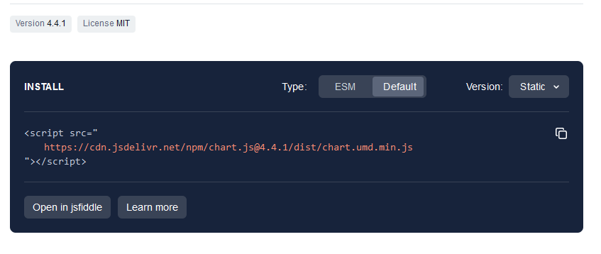
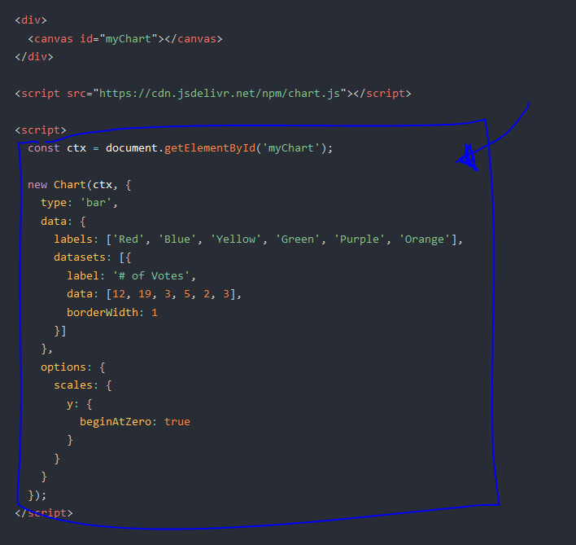
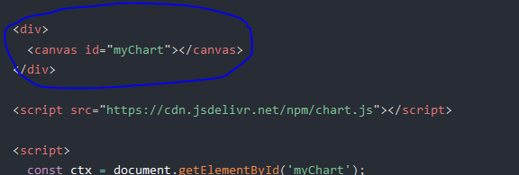
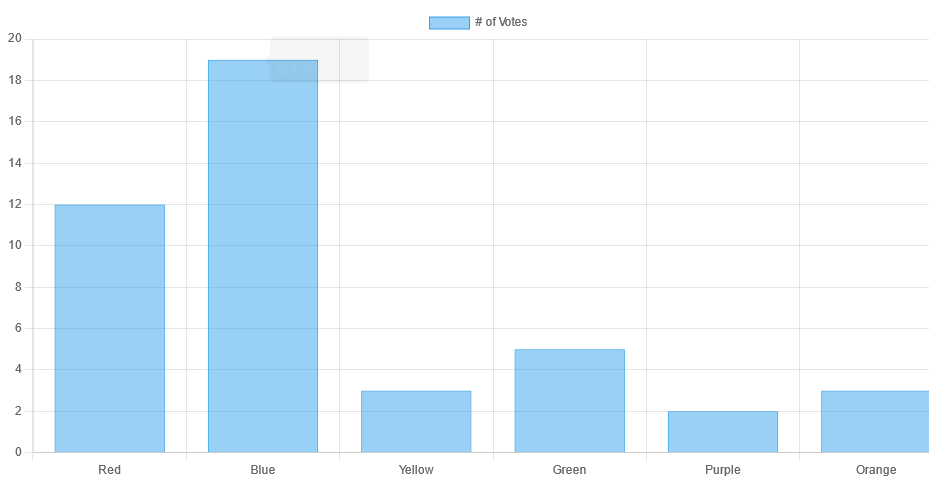

# Voorbeeld chart maken

> Eerst ga je een nieuwe chart maken en alvast de data structuur uitproberen zodat de datums en de meterstanden gebruikt worden.
> 

## starten

- maak een nieuwe file:
    - `jsonchart.html`
        - in de directory `public/07`
    - open `jsonchart.html` in visual studio code
        - gebruik `!` om een basis html opzet te maken

## Chart JS installeren

> LET OP! de `versie` kan `anders` zijn omdat dit in het `verleden geschreven` is

- ga naar:
    - https://www.chartjs.org/docs/latest/
        - ga naar de `install` pagina
        > 
    - click op de link naar:
        > 
    - daar zie je het `script` zet die tag in de `head` van je `jsonchart.html`
        > 

> nu halen we een `script` van een `CDN`
> - `Content Delivery Network`
> Dit is dus code van andere mensen die wij dan kunnen gebruiken
> - je zou ook het script kunnen downloaden en in je assets zetten dat werkt ook

## gebruiken

- maak een file:
    - `assets/js/chartApp.js`
        - in de directory `public/07`
- ga naar:
    - https://www.chartjs.org/docs/latest/getting-started/
    - zet nu het omcircled in je `chartApp.js`:
     > 

## canvas in html

- open je `jsonchart.html` in visual studio code
    - zet nu het omcirclede in je `jsonchart.html`:
     > 

- nu nog je `chartApp.js` koppelen:
    - maak een `nieuwe` script tag:
        - `onder` die van `chartjs`
        - `src` naar `chartApp.js`:
        - zet het type op:
            - `module`

## test!

- open je `jsonchart.html` in je browser:

> 

## klaar
- commit alles naar je github

